# Image-processing-programming

Image-processing-programming with python for univ. class

<br/>

<br/>

## 개발 환경 및 파이썬 문법 소개

<br/>

### jupyter 단축키

* jupyter에서 쓰는 파일 확장자는 .ipynb (i python notebook)!

* a, b : 위, 아래에 명령창 생성
* p : 명령들 모음
* h : 단축키 모음

<br/>

Numpy라는 라이브러리를 많이 사용할 듯

<br/>

### # 비슷한 점

* 함수, 클래스..
* if, for, while...

<br/>

### # 파이썬이 C/C++/Java와 다른점!

* 내부 자료구조를 가지고 있다.
* 표기법
* 기본적으로 ; 세미콜론을 붙이지 않는다.
* print()
  * 한 줄에 문장 두 개 이상을 표현할 때 사용한다.
  * print("Hello", end=""); print("World")
  * 기본적으로 \n를 포함한다.
* whlie i<10:
  * 문장이 두 줄 이상인 명령일 때 마지막에 콜론을 붙인다.
* { } 를 쓰지 않는다. 대신에 공백으로 구분한다.
* 기본적으로 변수 타입을 써주지 않는다.
  * Dynamic typing 방식.
  * i = 5
* ++ 와 같은 증감 연산자는 없다. +=1 로 하자.
* 한줄 주석은 #으로, 여러 줄 주석은 ''' ''' 또는 """ """으로 한다.
  * 프로그램이나 함수 등에 여러 줄 주석으로 써주면 Doc 내용이 된다~
* str 타입도 존재한다!

<br/>

### # 파이썬의 4가지 자료구조

* 시퀀스형(연속적)
  * list
    * [] 사용
    * 인덱스마다 접근가능 (순서가 있음)
    * 수정 가능
    * 요소마다 타입 달라도 가능
  * tuple
    * () 사용
    * 인덱스마다 접근가능
    * 수정 불가
    * 대신 list보다 접근 속도가 빠름
  * string
    * 튜플하고 비슷한 성격.
    * 인덱스마다 접근가능
    * 수정 불가
  * range()
    * for 문에서 사용이 많이 됨
    * range(1, 10, 2)
    * 1부터 시작해서 10 직전(9)까지 포함, 2씩 증가

<br/>

* 아닌것
  * dictionary
    * {} 사용
    * 인덱스로 접근 불가 (순서가 없음)
    * 예) d = {'a':1, 'b':2, 'c':10, 'z':100, 'p':50.4, 'q':'abc'}
    * {키:값 ... } 형태를 가짐
    * 키는 당연히 바뀌면 안됨 (따라서 튜플은 키로 쓸 수 있지만, 리스트는 불가능)
    * 요소마다 타입 달라도 가능
    * 예) key['a'] - 접근할 때 필요한 인덱스가 key 이름이라고 생각하면 될 듯. 
  * set
    * {} 사용
    * e = {1, 2, 3, 1}  # e의 원소는 1, 2 , 3 - 중복된 원소는 존재하지 않음
    * 인덱스로 접근 불가 (순서가 없음)

<br/>

* 그 외
  * a in b : a에 b가 들어있는지를 확인하여 반환. True / False return type을 가짐
  * 리스트, 튜플, 스트링 등 '+' 연산 가능 (range는 불가능)
  * len(a)
  * 슬라이싱 [start : end : step]
  * element / item 두 개의 차이!!

### # 함수

* int, float, str, list, tuple, dict, set, range

<br/>

### # 리스트의 메소드

* append() : 맨 끝에 요소 추가
* extend() : 리스트 확장
* insert() : 특정 인덱스에 요소 추가
* pop() : 요소 추가
* remove() : 특정 값을 찾아서 요소 삭제
* index() : 특정 값의 인덱스 찾기
* reverse() : 순서 뒤집기
* clear() : 모든 요소 삭제
* copy() : 리스트 복사

<br/>

### # 딕셔너리 메소드

* setdefault() : 키-값 쌍 추가
* update() : 특정 키의 값을 수정
* pop() : 키-값 쌍 삭제 후 값을 반환
* popitem() : 키-값 쌍 삭제 후 쌍을 튜플로 반환
* clear() : 모든 요소 삭제
* get() : 특정 키의 값 가져오기
* items() : 모든 키-값 쌍을 가져오기
* keys() : 모든 키를 가져오기
* values() : 모든 값을 가져오기
* fromkeys() : 키 리스트로 딕셔너리 생성 --> dict 클래스 메소드

<br/>

### # 제어문

* if, elif, else
* while

<br/>

### # 함수

* def():

<br/>

### # 클래스

```python
class Person:
    
    def greeting(self):
        print("Hello")
        
    def greeting2(self, who):
        print("Hello, ", who)
        
    def __init__(self, name, age):
        self.name = name
        self.age = age
        
    def whoami(self):
        print("I'm %s, I'm %d" %(self.name, self.age))
        
        
james = Person("James", 21)
james.greeting()
james.greeting2("sanggoe")
james.whoami()
        
        
        
class Student(Person):
    def __init__(self, name, age, grade=1):
        super().__init__(name, age)
        self.grade = grade
        
    def whoami(self):
        super().whoami()
        print("I am a student and my grade {0}".format(self.grade))
        
        
peter = Student("Peter", 22)
peter.greeting()
peter.whoami()
```

<br/>

### # import 이용하기

* 모듈 또는 객체 등을 불러 사용하기 위한 명령

```python
import random
print(random.randint(1,10))
```

```python
from math import floor as cut
print(cut(3.4))
```

```python
file = open("sample.txt", mode="w", encoding='utf-8')
file.write("Hello, world\n")
file.write("안녕하세요\n")
file.close()
```

```python
with open("sample.txt", encoding='utf-8') as file:
    print(file.read())
```

<br/>

### # 고급 문법

* 컴프리헨션(comprehension)
* 람다(rambda) 표현식
* 클로저(closer)
* 이터레이터(iterator)
* 제너레이터(generator)
* 코루틴(coroutine)
* 데코레이터(decorator)

<br/>

<br/>

## 3장 - NumPy와 Matplotlib

* 하나의 데이터에는 하나의 타입만 사용하고, 대신 속도를 빠르게 하자는 목적

<br/>

### 이미지와 NumPy

```python
import cv2
img = cv2.imread('img/jiheon.jpg')
print(type(img))
```

* .imread() : NumPy 배열을 반환하는 함수
* OpenCV를 파이썬으로 프로그래밍 한다는 것은 NumPy 배열을 다룬다는 것과 같다!

<br/>

### ndarray의 기본 속성

* Numpy 배열은 기본 자료구조로 ndarray라는 배열을 사용한다.
* ndarray의 기본 속성은다음과 같다.
   * **ndim**: 차원(축)의 수
      * Color면 3개일 것
   * **shape**: 각 차원의 크기 (튜플형태)
      * (가로, 세로, 차원의 수)
      * 차원은 흑백이면 1일 수 있지만 Color면 3개일 것
   * **size**: 전체 요소의 수
      * shape의 각 요소의 곱.
      * 가로 * 세로 * Color의 수
   * **dtype**: 요소의 데이터 타입
      * 기본적으로 정수
   * **itemsize**: 각 요소의 바이트 크기
      * 기본적으로 1byte

<br/>

### Numpy 배열 생성

#### 모듈 참조 선언

* 일반적으로 다음과 같이 쓴다.

```python
import numpy as np
```

<br/>

#### 배열 생성 - 값으로 생성

* numpy.**array**(list [, dtype]) : 지정한 값들로 NumPy 배열 생성

  * ```python
    a = np.array([1,2,3,4], np.uint8)
    ```

  * list : 배열 생성에 사용할 값을 가진 파이썬 리스트 객체

  * dtype : 데이터 타입 (생략시 값에 따라 자동 할당)

    * OpenCV에서 주로 쓰는 dtype은 unit8, int8, float32 정도
    * 정수, 실수 형태로 list를 준 경우, 큰 값을 기준으로 결정된다. (이 경우, 실수 float형으로)

* numpy.**unit8**([1,2,3,4])

  * ```python
    a = np.unit8([1,2,3,4])
    ```

  * dtype을 지정해줘야 하는 경우, 위와 같이 아예 해당 dtype으로 호출하는 함수도 정의되어 있다. 

<br/>

#### 배열 생성 - 크기와 초기 값으로 생성

* **dtype을 지정해 주지 않으면 default 값은 float64를 지정한다.**

* numpy**.empty**(shape, [, dtype])  : 초기화되지 않은(쓰레기) 값

  * ```python
    a = np.empty((2,3), np.uint8)
    ```

  * shape : **튜플 형태**로, 배열의 각 차수 크기 지정

* numpy**.zeros**(shape, [, dtype])  : 0으로 초기화

  * ```python
    a = np.zeros((2,3))
    ```

* numpy**.ones**(shape, [, dtype])  : 1로 초기화

  * ```python
    a = np.ones((2,3), 'float64')
    ```

* numpy**.full**(shape, fill_value, [, dtype])  : fill_value로 초기화

  * ```python
    a = np.full((5,5), 255)
    ```

<br/>

#### 생성된 배열 초기화

* **.fill**(value) : 배열의 모든 요소를 value로 채움

  * ```python
    a = np.empty((3,3))
    a.fill(255)
    ```

<br/>

#### 기존 배열의 크기와 같은 배열 생성

* numpy**.empty_like**(array [, dtype]) : array와 같은 shape, dtype을 가진 초기화되지 않은 배열 생성

  * ```python
    b = np.empty_like(a, np.uint8)
    ```

* numpy**.zeros_like**(array [, dtype]) : array와 같은 shape, dtype을 가진 0으로 초기화 된 배열 생성

  * ```python
    b = np.zeros_like(a)
    ```

* numpy**.ones_like**(array [, dtype]) : array와 같은 shape, dtype을 가진 1로 초기화 된 배열 생성

  * ```python
    b = np.ones_like(a, 'uint8')
    ```

* numpy**.full_like**(array, fill_value [, dtype]) : array와 같은 shape, dtype을 가진 fill_value로 초기화 된 배열 생성

  * ```python
    b = np.full_like(a, 255, np.uint8)
    ```

<br/>

#### 시퀀스와 난수로 생성

* numpy.**arange**([start=0, ] stop [, step=1, dtype=float64]) : 순차적인 값으로 생성

  * ```python
    a = np.arange(5)
    b = np.arange(0, 10, 2, 'float64')
    ```

  * 형식은 range 함수와 매우 유사하다.

  * start : 시작 값

  * stop : 종료 값 (stop은 미포함, -1 까지)

  * step : 증가 값

  * dtype : data type

* numpy.**random**.**rand**([d0 [d1 [ ..., dn]]]) : 0과 1 사이의 무작위 수 생성

  * ```python
    a = np.random.rand(2,3)
    ```

  * rand () 안의 내용은 배열의 모양 shape을 입력한다.

  * 예를 들어 rand(2,3) : shape이 (2,3)인 배열에 0~1 사이의 무작위 수를 넣어 생성

* numpy.**random**.**randn**([d0 [d1 [ ..., dn]]]) :" 0과 1 사이의 무작위 수 생성 : 표준정규분포(평균 : 0, 분산 : 1)를 따르는 무작위 수로 생성

  * ```python
    a = np.random.randn(2,3)
    ```

<br/>

#### dtype 변경 - 배열의 데이터 타입 변경

* ndarray.astype(dtype)

  * ```python
    b = a.astype(np.float64)
    or
    b = a.astype('float64')
    ```

  * dtype : 변경하고 싶은 dtype. 문자열 또는 dtype

    * 'float64' 또는 np.float64 등으로 값을 주면 됨

* numpy.uintXX(array) : array를 uintXX 타입으로 변경해서 반환

* numpy.intXX(array) : array를 intXX 타입으로 변경해서 반환

* numpy.floatXX(array) : array를 floatXX 타입으로 변경해서 반환

* numpy.complexXX(array) : array를 complexXX 타입으로 변경해서 반환

  * ```python
    b = np.uint8(a)
    c = np.int32(a)
    d = np.float64(a)
    e = np.complex64(a)
    ```

<br/>

#### 차원 변경

* ndarray.**reshape**(newshape) : ndarray의 shape를 newshape로 차원 변경

  * ```python
    a = np.arange(6)
    a.reshape(2,3)
    ```

  * 바꾸려는 ndarray 배열의 내부함수

  * newshape : 변경하려는 튜플형식의 새로운 shape

* numpy.**reshape**(ndarray, newshape) : ndarray의 shape를 newshape로 차원 변경

  * ```python
    b = np.reshape(a, (2,3))
    ```

  * numpy의 내부함수

  * ndarray : 원본 배열 객체

* Tip! newshape를 입력할 때, 남은 하나에 -1을 넣으면 알아서 계산해서 값을 넣어준다.

  * ```python
    a = np.arange(6)
    b = a.reshape(2,-1)
    or
    b = np.reshape(a, (-1, 2))
    ```

* numpy.**ravel**(ndarray) : 1차원 배열로 차원 변경

  * ```python
    a = np.reshape(np.arange(6), (2,3))
    b = np.ravel(a)
    or
    b = a.reshape(-1)
    ```

* ndarray.**T** : 전치배열(transpose) 만들기

  * ```python
    b = a.T
    ```

<br/>

### 브로드 캐스팅 연산

* 차원이 다른 배열끼리 연산이 가능하게 해주는 것

<br/>

#### 배열과 스칼라 값 사이의 연산

* NumPy 배열과 스칼라 값 간의 여러 가지 연산이 가능하다.

  * ```python
    a = np.arange(4) # array[1,2,3,4]
    a+1 # array[2,3,4,5]
    a-1 # array[1,2,3,4]
    a*2 # array[2,4,6,8]
    a/2 # array[1,2,3,4]
    a**2 # array[1,4,9,16]
    a > 2 # array[False,True,True,True]
    ```

<br/>

#### 배열끼리의 연산

* 배열끼리의 연산도 가능하다.

  * ```python
    a = np.arange(10, 60, 10) # array[10,20,30,40,50]
    b = np.arange(1,6) # array[1,2,3,4,5]
    a+b = [11,22,33,44,55]
    a-b = [9,18,27,36,45]
    a*b = [10,40,90,160,250]
    a/b = [10.,10.,10.,10.,10.]
    a**b = [10,400,27000,2560000,312500000]
    ```

<br/>

#### 브로드 캐스팅 조건

* **Shape이 똑같은** 두 배열끼리의 연산은 아무 문제 없다.

  * 위 배열끼리의 연산에서 예시와 같다.

* 다른 경우, **둘 중 하나가 1차원**이면서 **배열의 열의 개수가 같아야** 한다.

  * ```python
    a = np.arange(3)
    b = np.arange(6).reshape(2,3)
    c = np.arange(27).reshape(3,3,3)
    # 위와 같은 경우 a와 b, a와 c 연산 가능
    ```

<br/>

#### 규칙!

* 규칙 1: 두 배열의 차원 수가 다르면 더 작은 수의 차원을 가진 배열 shape의 앞쪽(왼쪽)을 1로 채운다.

* 규칙 2: 두 배열의 shape이 어떤 차원에서도 일치하지 않는다면 해당 차원의 shape이 1인 배열이 다른 shape과 일치하도록 늘어난다.

* 규칙 3: 임의의 차원에서 크기가 일치하지 않고 1도 아니라면 오류가 발생한다.

  * ```python
    # shape로 비교 예시
    (2,3,4) + (1,3,4) --> (2,3,4)
    (2,3,4) + (3,1) --> (2,3,4) + (1,3,1) --> (2,3,4)
    (1,3,4) + (3,3,1) --> (3,3,4) + (3,3,4)
    
    (2,4,5) + (1,4) --> (2,4,5) + (1,1,4) --> (2,4,5) + (2,4,4) # 오류 발생, 연산 불가!
    ```

<br/>

### 인덱싱과 슬라이싱

* 인덱싱은 말 그대로 인덱스 번호에 직접 접근하는 것을 말한다.

  * ```python
    a = np.arange(12).reshape(3,4)
    a[0][2] = 0 # (0,2) 위치의 요소 하나의 값을 0으로 변경
    a[1] = 1 # a의 두 번째 행의 모든 요소의 값을 1로 변경
    ```

* 파이썬에서 슬라이싱을 하면 '복사' 되어 저장되지만, NumPy에서는 속도와 메모리 등 최적화를 위해 레퍼런싱이 된다. 즉, 원본이 슬라이싱 되는 것이다.

  * ```python
    b = a[0:2, 1:3] # a[0][1], a[0][2], a[1][1], a[1][2] 레퍼런싱
    b[0,0] = 100 # a[0][1]의 값이 100으로 바뀜
    ```

* ndarray.**copy**() : 복제본을 얻기 위한 함수

  * ```python
    b = a.copy()
    ```

<br/>

### 팬시 인덱싱

* 인덱스에 다른 배열을 전달해서 원하는 요소를 선택하는 방법을 말한다.

* 숫자를 포함하면 인덱스에 맞게 선택

  * ```python
    a = np.arange(3,8) # array[3,4,5,6,7]
    a[[1,3,4]] # array[4,6,7] - 해당 인덱스의 요소들 선택
    ```

  * ```python
    a = np.arange(30).reshape(5,6)
    a # array([[ 0,  1,  2,  3,  4,  5],
      #        [ 6,  7,  8,  9, 10, 11],
      #        [12, 13, 14, 15, 16, 17],
      #        [18, 19, 20, 21, 22, 23],
      #        [24, 25, 26, 27, 28, 29]])
    
    a[3,4] # 22
    a[[3],[4]] # array([22])
    a[[0,2],[2,3]] # array([2, 15])
    ```

  * ```python
    b = np.arange(30).reshape(2,5,3)
    b # array([[[ 0,  1,  2],
      #         [ 3,  4,  5],
      #         [ 6,  7,  8],
      #         [ 9, 10, 11],
      #         [12, 13, 14]],
      #
      #        [[15, 16, 17],
      #         [18, 19, 20],
      #         [21, 22, 23],
      #         [24, 25, 26],
      #         [27, 28, 29]]])
    
    b[[0,1],[2,3],[1,2]] # array([7,26])
    b[[0,1,0,0,1], np.arange(5), np.random.randint(0,3,(5,))]
    # array([0~2,18~20,6~8,9~11,27~29])
    ```

* boolean 값을 포함하면 True인 값을 선택

  * ```python
    a[[True, False, True, False, True]] # array[3,5,7]
    a > 5 # array[False, False, False, True, True]
    a[(a>5)] # array[6,7]
    ```

<br/>

### 병합과 분리

#### 병합

* 어느 방향으로 붙여 나가느냐? 기준으로!

* ```python
  a = np.arange(4).reshape(2,2)
  a
  
  array([[0, 1],
        [2, 3]])
  
  b = np.arange(10,14).reshape(2,2)
  b
  
  array([[10, 11],
         [12, 13]])
  ```

* numpy.**hstack**(arrays) : 수평으로 병합, arrays는 병합 대상 배열(튜플형태로 넣어야 함)

  * ```python
    np.hstack((a,b)) # 영상처리에서 이미지 두 개를 가로로 연속으로 붙이고 싶을 때 쓸 수 있다.
    
    array([[ 0,  1, 10, 11],
           [ 2,  3, 12, 13]])
    # shape은 (2,2) 에서 (2,4)가 되었다.
    ```

* numpy.**vstack**(arrays) : 수직으로 병합

  * ```python
    np.vstack((a,b))
    
    array([[ 0,  1],
           [ 2,  3],
           [10, 11],
           [12, 13]])
    # shape은 (2,2) 에서 (4,2)가 되었다.
    ```

* numpy.**concatenate**(array, [axis=]0) : 지정한 축 기준으로 병합

  * ```python
    np.concatenate((a,b), 0) # 0번째 축 기준. vstack과 같고, 1을 쓰면 hstack과 같다
    # 배열은 왼쪽에서부터. 차원은 오른쪽에서부터
    ```

* numpy.**stack**(arrays, axis = 0) : 배열을 새로운 축으로 병합

  * ```python
    np.stack((a,b), 0)
    
    array([[[ 0,  1],
            [ 2,  3]],
    
           [[10, 11],
            [12, 13]]])
    # shape은 (2,2) 에서 (2,2,2)가 되었다.
    ```

<br/>

#### 분리

* 나누기 위해 칼질하는 방향이 아니라, 칼질 함으로서 **나누어지는 배열이 수평으로 나뉘느냐 수직으로 나뉘느냐이다**! 헷갈리지 말자. 예를 들어, 수직(vertical) 방향으로 칼질하면 **수평(horizontal)으로** (왼쪽 | 오른쪽) **두동강** 난다. 이렇게 **수평으로 나뉘게 만드는 함수는 hsplit()** 이다. 병합과 반대라 헷갈린다. 또한, 나누어 떨어지는 숫자로 분리 가능하다.

* ```python
  a = np.arange(12)
  a
  
  array([ 0,  1,  2,  3,  4,  5,  6,  7,  8,  9, 10, 11])
  
  b = np.arange(12).reshape(4,3)
  b
  array([[ 0,  1,  2],
         [ 3,  4,  5],
         [ 6,  7,  8],
         [ 9, 10, 11]])
  ```

* numpy.**vsplit**(arrays) : array 배열을 **수평 축 기준으로** 위 아래(vertical)를 분리

  * ```python
    np.vsplit(b, 2) # 칼질을 가로로 샥!! 해서 위 아래로 나누는 함수이다.
    [array([[0, 1, 2],
            [3, 4, 5]]),
     array([[ 6,  7,  8],
            [ 9, 10, 11]])]
    ```

* numpy.**hsplit**(arrays) : array 배열을 **수직 축 기준으로** 좌 우를(horizontal) 분리

  * ```python
    np.hsplit(a, 2)
    [array([0, 1, 2, 3, 4, 5]), array([ 6,  7,  8,  9, 10, 11])]
    
    np.hsplit(a, 3)
    [array([0, 1, 2, 3]), array([4, 5, 6, 7]), array([ 8,  9, 10, 11])]
    
    np.hsplit(a, 5) # 나누어 떨어지는 숫자로 해야함. Error
    ```

  * ```python
    np.hsplit(a, [2, 5]) # 인덱스 위치 기준으로 나누고 싶을 때!
    [array([0, 1]), array([2, 3, 4]), array([ 5,  6,  7,  8,  9, 10, 11])]
    
    np.hsplit(b, [2])
    
    # 부가 설명을 적어놓아야 되겠다.
    array([[ 0,  1,  2],
           [ 3,  4,  5],
           [ 6,  7,  8], # 왼쪽 b의 경우 [2]인덱스를 기준으로 나누고 싶을 때
           [ 9, 10, 11]])
    
    array([[ 0,  1, | 2],
           [ 3,  4, | 5], # 스샤샤샥..! 이렇게 자른다. 그럼 수평으로 뎅강 잘리겠지?
           [ 6,  7, | 8], # 그럼 일단 크게 왼쪽 그룹과 오른쪽 그룹으로 나뉠 것이다.
           [ 9, 10, |11]]) 
    
    [array([[ 0,  1],
            [ 3,  4],
            [ 6,  7], # 요로케. 왼쪽 그룹은 2개의 element를 가지고 있는 배열들이 될 것이고,
            [ 9, 10]]),
     array([[ 2],
            [ 5],	  # 오른쪽 그룹은 1개의 element를 가지고 있는 배열들이 될것이다.
            [ 8],
            [11]])]
    ```

* numpy.**split**(arrays, indice, [axis =] 0) : 배열을 axis축으로 분리

  * array : 분리할 배열

  * indice : 분리할 개수 또는 인덱스

  * axis : 기준 축 번호

  * ```python
    np.split(b, 2, 0) # b를 2개로 수직으로 분리 : vsplit과 같이 그룹이 위아래로 나뉠 것!
    [array([[0, 1, 2],
            [3, 4, 5]]),
     array([[ 6,  7,  8],
            [ 9, 10, 11]])]
    
    np.split(b, [2], 1) # b를 [2]기준으로 수평으로 분리 : hsplit과 같이 왼쪽[2개] 오른쪽[1개] 그룹으로 나뉠 것!
    [array([[ 0,  1],
            [ 3,  4],
            [ 6,  7],
            [ 9, 10]]),
     array([[ 2],
            [ 5],
            [ 8],
            [11]])]
    
    np.split(b, 2, 1) # b를 2개로 수평으로 분리 : Error! 반드시 나누어 떨어지는 숫자만 가능
    
    np.split(b,[1,2],1) # b를 [1,2]기준으로 수평으로 분리
    np.split(b, 3, 1) # b를 3개로 수평으로 분리. 위와 결과가 같다.
    [array([[0],
            [3],
            [6],
            [9]]),
     array([[ 1],
            [ 4],
            [ 7],
            [10]]),
     array([[ 2],
            [ 5],
            [ 8],
            [11]])]
    ```

<br/>

### 검색기능

```python
a = np.arange(12).reshape(3,4)
a

array([[ 0,  1,  2,  3],
       [ 4,  5,  6,  7],
       [ 8,  9, 10, 11]])
```

* ret = numpy.where(condition [, t, f]) : 조건에 맞는 요소 찾기

  * ret : return된 배열(튜플)

  * condition : 조건식

  * t : 조건에 맞는 값에 지정할 값이나 배열(조건과 같은 shape)

  * f : 조건에 틀린 값에 지정할 값이나 배열

  * ```python
    coords = np.where(a>6) # 조건에 해당하는 배열의 인덱스를 반환! 행값 열값 배열 따로!
    coords
    (array([1, 2, 2, 2, 2], dtype=int64), array([3, 0, 1, 2, 3], dtype=int64))
    
    # 위에 행,열 따로 나온 배열을 stack으로 합해서 좌표 정보를 얻을 수 있다
    np.stack((coords[0], coords[1]), 1) # 
    array([[1, 3],
           [2, 0],
           [2, 1],
           [2, 2],
           [2, 3]], dtype=int64)
    ```

* numpy.nonzero(array) : array에서 요소 중 0이 아닌 요소의 인덱스들을 반환(튜플)

  * ```python
    b = np.array([0,1,2,0,1,2])
    np.nonzero(b)
    (array([1, 2, 4, 5], dtype=int64),)
    
    c = np.array([[0,1,2],[1,2,0],[2,0,1]])
    c
    array([[0, 1, 2],
           [1, 2, 0],
           [2, 0, 1]])
    np.nonzero(c) # 행 인덱스 배열, 열 인덱스 배열을 반환
    (array([0, 0, 1, 1, 2, 2], dtype=int64),
     array([1, 2, 0, 1, 0, 2], dtype=int64))
    ```

* numpy.all(array [, axis]) : array의 모든 요소가 True인지 검색

  * array : 검색 대상 배열

  * axis : 검색 기준 축. 생략 시 모든 요소, 지정시 축 개수별로 결과 반환

  * ```python
    d = np.array([[[True, False, True, True],
                   [True, True, False, True],
                   [True, True, True, True]],
                  
                  [[True, True, True, True],
                   [True, False, True, True],
                   [True, True, True, True]]])
    d
    array([[[ True, False,  True,  True],
            [ True,  True, False,  True],
            [ True,  True,  True,  True]],
    
           [[ True,  True,  True,  True],
            [ True, False,  True,  True],
            [ True,  True,  True,  True]]])
    
    d.shape
    (2, 3, 4)
    
    np.all(d)
    False
    
    np.all(d, 0) # 0번축, 두 그룹의 같은 인덱스 위치에 있는 요소들이 모두 True인가?
    array([[ True, False,  True,  True], # 즉, [0,0,0]와 [1,0,0] 두 인덱스 모두 True인가?
           [ True, False, False,  True], # [0,0,1][1,0,1] 체크?, [0,0,2][1,0,2] 체크?..
           [ True,  True,  True,  True]]) # 이런식으로 모든 인덱스 위치를 다 비교하여 체크한 값
    
    np.all(d, 1) # 1번축, 각 그룹의 세로(행)로 같은 인덱스 위치끼리 비교하여 해당 요소가 모두 참?
    array([[ True, False, False,  True],
           [ True, False,  True,  True]])
    
    np.all(d, 2) # 2번축, 각 행에 들어있는 요소들 모두(4개)를 체크하며 모두 True인지 체크!
    array([[False, False,  True],
           [ True, False,  True]])
    # 되게 복잡하지만, 하나하나 따라가보면 어렵지 않다.
    ```

* numpy.any(array [, axis]) : array의 요소 중 하나라도 True가 있는지 검색

  * ```python
    np.any(d) # 한번에 요소 싹다 검사. 하나라도 True?
    True
    
    np.any(d, 1) # 1번축 기준으로 그룹지어서 검사. 하나라도 True?
    array([[ True,  True,  True,  True],
           [ True,  True,  True,  True]])
    ```

<br/>

### 통계 함수

```python
a = np.arange(12).reshape(3,4)
a
array([[ 0,  1,  2,  3],
       [ 4,  5,  6,  7],
       [ 8,  9, 10, 11]])
```

* sum(array [,axis]) : 배열의 합계

  * ```python
    np.sum(a)
    66
    
    np.sum(a,0)
    array([12, 15, 18, 21])
    ```

* mean 평균

  * ```python
    np.mean(a)
    5.5
    
    np.mean(a, 0)
    array([4., 5., 6., 7.])
    ```

* amin 최솟값 min()과 동일

  * ```python
    np.amin(a,1)
    array([0, 4, 8])
    ```

* amax 최댓값 max()와 동일

  * ```python
    np.amax(a,0)
    array([8, 9, 10, 11])
    ```

<br/>

#### 참고 ... 짚고 넘어가기

* Numpy, Pandas 는 기본적으로 많이 사용되니까 공부하면 좋을 것 같다..!!
* **Numpy와 Python과의 차이..!**
  * Slicing 할 때 다르다! 파이썬에선 Copy 가 되지만, 넘파이에선 레퍼런싱 된다.
  * Array의 Type이 다르다! 파이썬에서는 array의 종류가 여러개가 되지만, 넘파이에서는 array의 종류가 한 종류만 있다.
* 아래서 배울 Matplotlib도 알아두면 쓸 일이 있을거다.

<br/>

###  Matplotlib

* 파이썬에서 많이 사용하는 시각화 라이브러리

<br/>

#### 선언

```python
from matplotlib import pyplot as plt
import numpy as np
```

<br/>

#### plot

* 그래프를 그리는 가장 간단한 방법이 plot() 함수를 이용하는 방법이다.

```python
a = np.array([2,5,4,3,12,10])
b = np.array([10,2,3,4,26,11])
plt.plot(a) # x축에는 인덱스 번호, y축에는 값을 그래프로 표시한다!
plt.plot(b)
plt.show() # 그래프 보여줘
```

* 출력 결과는 다음과 같다.


<br/>

```python
x = np.arange(10)
y = x**2
plt.plot(x,y,'g') # 그래프의 색깔 바꿀 수 있다! 보통 영어 단어 첫글자. green
plt.show()
```

* 출력


<br/>

```python
x=np.arange(10)

f1 = x * 5
f2 = x ** 2
f3 = x ** 2 + x * 2

plt.plot(x, 'r--') # 점선
plt.plot(f1, 'g.') # 점 점 점 점
plt.plot(f2, 'bv') # 역 삼각형
plt.plot(f3, 'ks') # 네모

plt.show()
```

* 출력


<br/>

```python
x = np.arange(10)

plt.subplot(2,2,1) # 2x2 바둑판 모양으로, 네 개중 첫 번째에 써주라는 의미
plt.plot(x, x**2, 'g')

plt.subplot(2,2,2)
plt.plot(x, x*5)

plt.subplot(223) # , 안써도 되긴하지만, 내가 헷갈림
plt.plot(x, np.sin(x))

plt.subplot(224)
plt.plot(x, np.cos(x))

plt.show()
```

* 출력


<br/>

```python
import cv2

img = cv2.imread('img/jiheon.jpg') # OpenCV는 기본적으로 Color로 인식!!
img2 = cv2.imread('img/jiheon.jpg') # 그레이 스케일을 지정할 수도 있다!!
plt.subplot(1,2,1)
plt.imshow(img)
plt.subplot(1,2,2)
plt.imshow(img2)
plt.show()

# OpenCV에서 읽어 들일 때 RGB가 아니라 BGR 순으로 저장된다.
# 따라서.. R과B가 반전되어 파랗게 보이는 것이다..
# 그 값의 위치를 반전시켜주는 방법으로 해결할 수 있다..!!
```

* 출력.. 안돼 우리 지헌이.. 미안해ㅜ 얼굴은 가릴게


<br/>

```python
plt.subplot(1,2,1)
plt.imshow(img[:,::-1,::-1]) # y축 픽셀(좌우대칭), 모든 칼라를 거꾸로 출력하라!
# [x, y, color] 이다.
plt.xticks([]) # x축 비워버려라
plt.yticks([]) # y축 비워버려라

plt.subplot(1,2,2)
plt.imshow(img2[::-1,:,::-1]) # x축 픽셀(상하대칭), 모든 칼라를 거꾸로 출력하라!
img2.fill(0)
plt.xticks([]) # x축 비워버려라
plt.yticks([]) # y축 비워버려라
plt.show()
```

* 출력. 좌우대칭 지헌이 / 상하대칭 지헌이


<br/>

<br/>

## 2장 기본 입출력

<br/>

### 이미지 만드는 방법 3가지

* 이미지 파일이나 동영상 캡처
* openCV의 그리기 함수
* Numpy 배열

<br/>

### 1. 이미지와 비디오 입력

#### 이미지 읽기

* img = **cv2.imread**(file_name [, mode_flag]) : 파일로부터 이미지 읽기
  * file_name : 이미지 경로 문자열
  * mode_flag = cv2.IMREAD_COLOR : 읽기 모드 지정
    * cv2.IMREAD_COLOR : 색상(BGR) 스케일로 읽기, default
    * cv2.IMREAD_UNCHANGED : 파일 그대로 읽기
    * cv2.IMREAD_GRAYSCALE : 흑백 스케일로 읽기
  * img : 읽은 이미지, NumPy 배열
  * cv2.imshow(title, img): 이미지를 화면에 표시
  * title : 창 제목, 문자열
* key = **cv2.waitKey**([delay]) : 키보드 입력 대기
  * delay=0 : 키보드 입력 대기할 시간(ms), 0: 무한대(default)
  * key : 사용자가 입력한 값, 정수
    * -1 : 대기 시간동안 입력값 없음

<br/>

* 이미지를 회색으로 읽어 출력하고, 아무 키나 누르면 창을 닫는 코드

```python
import cv2
img_file = 'img/jiheon.jpg'
img = cv2.imread(img_file, cv2.IMREAD_GRAYSCALE) # 이미지 파일이 없으면 에러 발생. 따라서 예외처리! # Gray image 로 읽는것!
if img is not None:
    cv2.imshow('IMG', img)
    cv2.waitKey(0) # milisec 단위 시간만큼 키 입력을 기다림. 0은 무한.
#    cv2.destroyAllWindows # 현재 상태에서 열린 모든 윈도우를 닫아준다.
    cv2.destroyWindow('IMG') # 해당 이름의 윈도우를 닫는다
else:
    print('No image file.')
```

<br/>

#### 이미지 저장하기

* **cv2.imwrite**(file_path, img) : 이미지를 파일에 저장
  * file_path : 저장할 파일 경로 이름, 문자열
  * img : 저장할 영상, NumPy 배열

<br/>

* 위 코드에, 해당 사진을 저장하는 코드를 추가

```python
import cv2
img_file = 'img/jiheon.jpg'
save_file = 'img/jeheon_gray.jpg' # 저장할 경로 및 이름
img = cv2.imread(img_file, cv2.IMREAD_GRAYSCALE)
if img is not None:
    cv2.imshow('IMG', img)
    cv2.imwrite(save_file, img) # save_file 문자열 경로에 저장한다.
    cv2.waitKey(0)
    cv2.destroyWindow('IMG')
else:
    print('No image file.')
```

<br/>

#### 동영상 및 카메라 프레임 읽기

* cap = **cv2.VideoCapture**(file_path or index) : 비디오 캡처 객체 생성자
  * file_path : 동영상 파일 경로
  * index : 카메라 장치 번호, 0부터 순차적으로 증가
  * cap : VideoCapture 객체
* ret = **cap.isOpened**() : 객체 초기화 확인
  * ret : 초기화 여부, True / False
* ret, img = **cap.read**() : 영상 프레임 읽기
  * ret : 프레임 읽기 성공 실패 여부, True / False
  * img : 프레임 이미지, NumPy 배열 또는 None
* **cap.set**(id, value) : 프로퍼티 변경
* **cap.get**(id) : 프로퍼티 확인
* **cap.release**() : 캡처 자원 반납

<br/>

#### 카메라(웹캠) 프레임 읽기

```python
import cv2

cap = cv2.VideoCapture(0) # 0번 카메라 장치 연결
if cap.isOpened():
    while True:
        ret, img = cap.read() # 카메라 프레임 읽기
        if ret: # 성공적으로 읽어왔으면
            cv2.imshow('camera', img) # 프레임 이미지 표시
            if cv2.waitKey(1) != -1: # 1ms 대기하면서 아무키나 눌린 경우 중지
                break
        else:
            print('no frame')
            break
else:
    print("can't opne camera.")
cap.release()
cv2.destroyAllWindows()
```

<br/>

#### 카메라 비디오 속성 제어

* 속성 ID: 'cv2.CAP_PROP_' 로 시작하는 상수
  * CAP_PROP_FRAME_WIDTH: 프레임 폭
  * CAP_PROP_FRAME_HEIGHT: 프레임 높이
  * **CAP_PROP_FPS: 초당 프레임의 수**
  * CAP_PROP_POS_MSEC: 동영상 파일의 프레임 위치(ms)
  * CAP_PROP_POS_AVI_RATIO: 동영상 파일의 상대 위치(0: 시작, 1: 끝)
  * CAP_PROP_POS_FOURCC: 동영상 파일 코덱 문자
  * CAP_PROP_POS_AUTOFOCUS: 카메라 자동 초점 조절
  * CAP_PROP_ZOOM: 카메라 줌
* 각 항목들을 확인할 때는 `get`, 변경할 때는 `set`을 통해 할 수 있습니다.

<br/>

* 비디오 파일을 읽어 FPS를 지정하여 동영상 재생
  * 디지털 영상은 스틸 이미지를 연속해서 보여주는것! 주로 초당 30 Frame.

```python
import cv2

video_file = "img/meat.mp4"

cap = cv2.VideoCapture(video_file) # 동영상 캡처 객체 생성
if cap.isOpened():  # video가 비어있는지, 존재 하는지 체크 (예외처리)
    fps = cap.get(cv2.CAP_PROP_FPS) # 프레임 수 구하기
    delay = int(1000/fps) # delay 시간 구하는 공식 1000ms/fps
    while True:
        ret, img = cap.read() # 읽는거
        
        if ret:
            cv2.imshow(video_file, img) # 매 순간 이미지를 
            cv2.waitKey(delay)          # 초당 뿌리는 것
        else:
            break
    cv2.destroyAllWindows()
else:
    print('No video file.')
```

<br/>

* 카메라 프레임 크기 설정 예제

```python
# 카메라 프레임 크기 설정
import cv2

cap = cv2.VideoCapture(0)
width = cap.get(cv2.CAP_PROP_FRAME_WIDTH)
height = cap.get(cv2.CAP_PROP_FRAME_HEIGHT)
print("Original width: %d, height: %d" % (width, height))

cap.set(cv2.CAP_PROP_FRAME_WIDTH, 320)
cap.set(cv2.CAP_PROP_FRAME_HEIGHT, 240)
width = cap.get(cv2.CAP_PROP_FRAME_WIDTH)
height = cap.get(cv2.CAP_PROP_FRAME_HEIGHT)
print("Resized width: %d, height: %d" % (width, height))

if cap.isOpened():
    while True:
        ret, img = cap.read()
        if ret:
            cv2.imshow('camera', img)
            if cv2.waitKey(1) != -1:
                break
        else:
            print('no frame!')
            break
else:
    print("can't open camera!")
cap.release()
cv2.destroyAllWindows()
```

<br/>

#### 비디오 파일 프레임으로 저장하기

* 비디오 파일을 프레임으로 저장하는 코드
  * 캡처를 하거나 디지털 카메라로 사진 찍는 것과 같다!
  * 이미지 저장하기의 **cv2.imwrite**() 함수를 그대로 사용하면 된다.

```python
import cv2

video_file = "img/meat.mp4"
cap = cv2.VideoCapture(video_file) # 0으로 넣으면 카메라 녹화 화면..

if cap.isOpened():  # video가 비어있는지, 존재 하는지 체크 (예외처리)
    fps = cap.get(cv2.CAP_PROP_FPS) # 프레임 가져오기
    delay = int(1000/fps)
    while True:
        ret, img = cap.read() # 읽는거
        if ret:
            cv2.imshow(video_file, img) # 매 순간 이미지를 출력
            if cv2.waitKey(delay) != -1: # 뭔가 입력을 받으면
                cv2.imwrite('img/photo.jpg', img) # 저장
                break # 저장 되자마자 종료
        else:
            break
    cv2.destroyAllWindows() # 모든 열린 창 닫기
else:
    print('No video file.')
```

<br/>

#### 비디오 파일 영상으로 저장하기

* writer = **cv2.VideoWriter**(file_path, fourcc, fps, (width, height)) : 비디오 저장 클래스 생성자 함수
  * file_path: 비디오 파일 저장 경로
  * fourcc: 비디오 인코딩 형식 4글자
  * fps: 초당 프레임 수
  * (width, height): 프레임 폭과 높이
  * writer: 생성된 비디오 저장 객체
* **writer.write**(frame): 프레임 저장
  * frame: 저장할 프레임, NumPy 배열
* **writer.set**(id, value): 프로퍼티 변경
* **writer.get**(id): 프로퍼티 확인
* ret = writer.fourcc(c1, c2, c3, c4): fourcc 코드 생성
  * c1, c2, c3, c4: 인코딩 형식 4글자, 'MJPG', 'DIVX' 등
  * ret: fourcc 코드
* cv2.VideoWriter_fourcc(c1, c2, c3, c4): cv2.VideoWriter.fourcc()와 동일

<br/>

* 키보드 입력하기 전까지의 영상을 저장하는 코드

```python
# 카메라로 녹화하기
import cv2

# video_file = "img/meat.mp4"
cap = cv2.VideoCapture(0) # video_file를 넣으면 해당 비디오 파일에 대해 수행 
if cap.isOpened():
    file_path = './record.mp4'
    fps = 25.40
    fourcc = cv2.VideoWriter_fourcc(*'DIVX')
    width = cap.get(cv2.CAP_PROP_FRAME_WIDTH)
    height = cap.get(cv2.CAP_PROP_FRAME_HEIGHT)
    size = (int(width), int(height))
    out = cv2.VideoWriter(file_path, fourcc, fps, size)
    while True:
        ret, frame = cap.read()
        if ret:
            cv2.imshow('camera-recording',frame)
            out.write(frame)
            if cv2.waitKey(int(1000/fps)) != -1:
                break
        else:
            print("no frame!")
            break
    out.release()
else:
    print("Can't open camera!")
cap.release()
cv2.destroyAllWindows()
```

<br/>

### 2. openCV 그리기

* openCV로 그리려면, 그림판 역할의 빈 NumPy 배열 이미지가 필요하다.

```python
import numpy as np
import cv2

img = np.full((500,500,3), 255, dtype=np.uint8)
cv2.imwrite('img/blank_500.jpg', img)
```

<br/>

#### 직선 그리기
* **cv2.line**(img, start, end, color [, thickness, linetype])
    * img: 그림 그릴 대상 이미지, Numpy 배열
    * start: 선 시작 지점 좌표(x,y)
    * end: 선 끝 지점 좌표(x,y)
    * color: (Blue, Green, Red), 0~255 # openCV는 BGR 순서다!
    * thickness=1:선 두께
    * lineType:선 그리기 형식
        * cv2.LINE_4:4 연결 선 알고리즘
        * cv2.LINE_8:8 연결 선 알고리즘
        * cv2.LINE_AA: 안티에일리어싱(anti-aliasing, 계단 현상 없는 선)

<br/>

* 다양한 직선을 그리는 예제

```python
import cv2

img = cv2.imread('./img/blank_500.jpg')

# (x,y 이므로) x축 즉, 가로로 100 길이의 (BGR 순서) Blue색 직선
cv2.line(img, (50,50), (150,50), (255,0,0)) 
cv2.line(img, (200,50), (300,50), (0,255,0))
cv2.line(img, (350,50), (450,50), (0,0,255))

# 마지막 인자: 두께
cv2.line(img, (100,100), (400,100), (255,255,0), 10)
cv2.line(img, (100,150), (400,150), (255,0,255), 10)
cv2.line(img, (100,200), (400,200), (0,255,255), 10)
cv2.line(img, (100,250), (400,250), (200,200,200), 10)
cv2.line(img, (100,300), (400,300), (0,0,0), 10)

# 마지막 인자: 선 그리기 형식
cv2.line(img, (100,350), (400,400), (0,0,255), 20, cv2.LINE_4)
cv2.line(img, (100,400), (400,450), (0,0,255), 20, cv2.LINE_8)
cv2.line(img, (100,450), (400,500), (0,0,255), 20, cv2.LINE_AA)

cv2.imshow('lines', img) 
cv2.waitKey(0)
cv2.destroyAllWindows()
```

* 결과

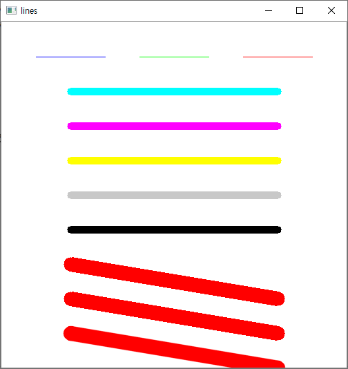

<br/>

#### 사각형그리기
* **cv2.rectangle**(img, start, end, color [, thickness, linetype])
    * img: 그림 그릴 대상 이미지, Numpy 배열
    * start: 사각형 시작 꼭지점(x,y)
    * end: 사각형 끝 꼭지점(x,y)
    * color: 색상(Blue, Green, Red)
    * thickness: 선 두께
        - -1: 채우기
    * lineType: 선타입, cv2.line()과 동일

<br/>

* 다양한 사각형을 그리는 예제

```python
import cv2

img = cv2.imread('./img/blank_500.jpg')

cv2.rectangle(img, (50,50), (150,150), (255,0,0)) # 채우기 없음
cv2.rectangle(img, (300,300), (100,100), (0,255,0), 10) # 선 두께 10
cv2.rectangle(img, (450,200), (200,450), (0,0,255), -1) # -1은 채워 그리기

cv2.imshow('rectangle', img) 
cv2.waitKey(0)
cv2.destroyAllWindows()
```

* 결과

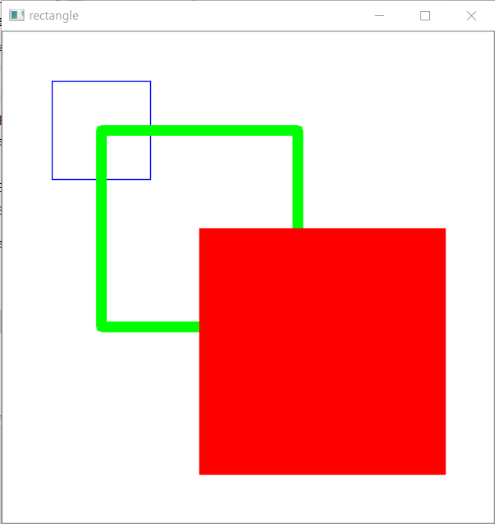

<br/>

#### 다각형 그리기
* **cv2.polylines**(img, points, isClosed, color [, thickness, linetype])
    * img: 그림 그릴 대상 이미지
    * points: 꼭지점 좌표, NumPy 배열 리스트
    * isClosed: 닫힌 도형 여부, True/False - 처음과 마지막 좌표를 잇는다
    * color: 색상(Blue, Green, Red)
    * thickness: 선 두께
    * lineType: 선타입, cv2.line()과 동일

<br/>

* 다양한  다각형을 그리는 예제

```python
import cv2

img = cv2.imread('./img/blank_500.jpg')

pts1 = np.array([[50,50],[150,150],[100,140],[200,240]], dtype=np.int32) # 번개모양
pts2 = np.array([[350,50],[250,200],[450,200]], dtype=np.int32) # 삼각형
pts3 = np.array([[150,300],[50,450],[250,450]], dtype=np.int32) # 삼각형
pts4 = np.array([[350,250],[450,350],[400,450],[300,450],[250,350]], dtype=np.int32) # 오각형

cv2.polylines(img, [pts1], False, (255,0,0)) # 열린 파란색 번개모양 다각형 그리기
cv2.polylines(img, [pts2], False, (0,0,0), 10) # 열린 검정색 두께 10의 삼각형 그리기
cv2.polylines(img, [pts3], True, (0,0,255), 10) # 닫힌 빨간색 두께 10의 삼각형 그리기
cv2.polylines(img, [pts4], True, (0,0,0)) # 닫힌 오각형 그리기

cv2.imshow('polyline', img) 
cv2.waitKey(0)
cv2.destroyAllWindows()
```

* 결과

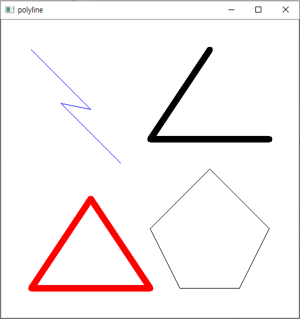

<br/>

#### 2.2.4 원, 타원, 호 그리기
* **cv2.circle**(img, center, radius, color [, thickness, linetype])
    * img: 그림 그릴 대상 이미지
    * center: 원점 좌표(x,y)
    * color: 색상(Blue, Green, Red)
    * thickness=1: 선 두께
        -1: 채우기
    * lineType: 선타입, cv2.line()과 동일
* **cv2.ellipse**(img, center, axes, angle, from, to, color [, thickness, linetype])
    * img: 그림 그릴 대상 이미지
    * center: 원점 좌표(x,y)
    * axes: 기준 축 길이(가로, 세로)
    * angle: 기준 축 회전 각도
    * from, to: 호를 그릴 시작 각도와 끝 각도
    * color: (Blue, Green, Red), 0~255 # openCV는 BGR 순서다!
    * thickness: 선 두께
    * lineType: 선타입, cv2.line()과 동일

<br/>

* 다양한 원 종류를 그리는 예제

```python
import cv2

img = cv2.imread('img/blank_500.jpg')

cv2.circle(img, (150,150), 100, (255,0,0)) # 반지름이 100인 파란색 원
cv2.circle(img, (300,150), 70, (0,255,0), 5) # 두께 5, 반지름이 70인 초록색 원
cv2.circle(img, (400,150), 50, (0,0,255), -1) # 반지름이 50인 빨간색 채운 원

cv2.ellipse(img, (50,300), (50,50), 0, 0, 360, (0,0,255)) # 타원
cv2.ellipse(img, (150,300), (50,50), 0, 0, 180, (255,0,0)) # 아래 반원
cv2.ellipse(img, (200,300), (50,50), 0, 181, 360, (0,0,255)) # 위 반원

cv2.ellipse(img, (325,300), (75,50), 0, 0, 360, (0,255,0)) # 납작 타원
cv2.ellipse(img, (450,300), (50,75), 0, 0, 360, (255,0,255)) # 홀쭉 타원

cv2.ellipse(img, (50,425), (50,75), 15, 0, 360, (0,0,0)) # 회전 타원
cv2.ellipse(img, (200,425), (50,75), 45, 0, 360, (0,0,0)) # 회전 타원

cv2.ellipse(img, (350,425), (50,75), 45, 0, 180, (0,0,255)) # 회전 반원
cv2.ellipse(img, (400,425), (50,75), 45, 181, 360, (255,0,0)) # 회전 타원

cv2.imshow('polyline', img) 
cv2.waitKey(0)
cv2.destroyAllWindows()
```

* 결과

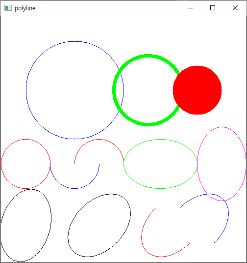

<br/>

#### 글씨 그리기
* **cv2.putText**(img, text, point, fontFace, fontSize, color [, thickness, lineType])
    * img: 그림 그릴 대상 이미지
    * text: 표시할 문자열
    * point: 글씨를 표시할 좌표(좌측 하단 기준)(x,y)
    * fontFace: 글꼴
        * cv2.FONT_HERSHEY_PLAIN: 산세리프체 작은 글꼴
        * cv2.FONT_HERSHEY_SIMPLEX: 산세리프체 일반 글꼴
        * cv2.FONT_HERSHEY_DUPLEX: 산세리프체 진한 글꼴
        * cv2.FONT_HERSHEY_COMPLEX_SMALL: 세리프체 작은글꼴
        * cv2.FONT_HERSHEY_COMPLEX: 세리프체 일반 글꼴
        * cv2.FONT_HERSHEY_TRIPLEX: 세리프체 진한 글꼴
        * cv2.FONT_HERSHEY_SCRIPT_SIMPLEX: 필기체 산세리프 글꼴
        * cv2.FONT_HERSHEY_SCRIPT_COMPLEX: 필기체 세리프 글꼴
        * cv2.FONT_ITALIC: 이탤릭체 플래그
    * fontSize: 글꼴 크기
    * color, thickness, lineType: cv2.rectangle()과 동일

<br/>

* 다양한 글자를 그리는 예제

```python
import cv2

img = cv2.imread('./img/blank_500.jpg')

cv2.putText(img, "Plain", (50,30), cv2.FONT_HERSHEY_PLAIN, 1, (0,0,0))
cv2.putText(img, "Simplex", (50,70), cv2.FONT_HERSHEY_SIMPLEX, 1, (0,0,0))
cv2.putText(img, "Duplex", (50,110), cv2.FONT_HERSHEY_DUPLEX, 1, (0,0,0))
cv2.putText(img, "Simplex", (200,110), cv2.FONT_HERSHEY_SIMPLEX, 2, (0,0,250))

cv2.putText(img, "Complex Small", (50,180), cv2.FONT_HERSHEY_COMPLEX_SMALL, 1, (0,0,0))
cv2.putText(img, "Complex", (50,220), cv2.FONT_HERSHEY_COMPLEX, 1, (0,0,0))
cv2.putText(img, "Triplex", (50,260), cv2.FONT_HERSHEY_TRIPLEX, 1, (0,0,0))
cv2.putText(img, "Complex", (200,260), cv2.FONT_HERSHEY_TRIPLEX, 2, (0,0,255))

cv2.putText(img, "Script Simplex", (50,330), cv2.FONT_HERSHEY_SCRIPT_SIMPLEX, 1, (0,0,0))
cv2.putText(img, "Script Complex", (50,370), cv2.FONT_HERSHEY_SCRIPT_COMPLEX, 1, (0,0,0))

cv2.putText(img, "Plain Italic", (50,430), cv2.FONT_ITALIC, 1, (0,0,0))
cv2.putText(img, "Complex Italic", (50,30), cv2.FONT_ITALIC, 1, (0,0,0))

cv2.imshow('draw text', img)
cv2.waitKey()
cv2.destroyWindow('draw text')
```

* 결과

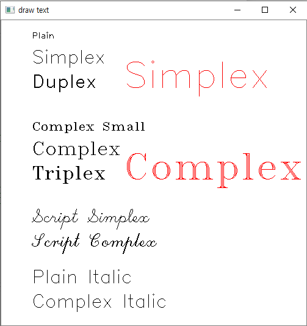

* 뭐지? 이태릭 글씨체가 안나온다.

<br/>

### 실습 과제1) 배운것들 한 페이지에 다 출력

* 실습 코드

```python
import numpy as np
import cv2

# openCV로 그리려면, 그림판 역할의 빈 NumPy 배열 이미지가 필요하다.
img = np.full((500,500,3), 255, dtype=np.uint8) # 500*500크기의 컬러를 저장할 빈 numpy 배열 선언
cv2.imwrite('img/blank_500.jpg', img) # 저장

img = cv2.imread('./img/blank_500.jpg')

# lines (x,y 이므로) x축 즉, 가로로 100 길이의 (BGR 순서) Blue색 직선
cv2.putText(img, "Lines", (30,20), cv2.FONT_ITALIC, 0.5, (0,0,0))
cv2.line(img, (50,30), (150,30), (255,0,0)) 
cv2.line(img, (200,30), (300,30), (0,255,0))
cv2.line(img, (350,30), (450,30), (0,0,255))

# rectanglues
cv2.putText(img, "Rectanglue", (30,60), cv2.FONT_HERSHEY_PLAIN, 1, (255,0,255))
cv2.rectangle(img, (80,70), (120,110), (255,0,0)) # 채우기 없음
cv2.rectangle(img, (230,70), (270,110), (0,255,0), 10) # 선 두께 10
cv2.rectangle(img, (380,70), (420,110), (0,0,255), -1) # -1은 채워 그리기

# Polylines
cv2.putText(img, "Polyline", (30,150), cv2.FONT_HERSHEY_COMPLEX_SMALL, 1, (0,210,210))
pts1 = np.array([[25,160],[70,200],[50,200],[95,240]], dtype=np.int32) # 번개모양
pts2 = np.array([[165,160],[115,240],[215,240]], dtype=np.int32) # 삼각형
pts3 = np.array([[290,160],[240,240],[340,240]], dtype=np.int32) # 삼각형
pts4 = np.array([[405,150],[455,200],[430,250],[380,250],[355,200]], dtype=np.int32) # 오각형

cv2.polylines(img, [pts1], False, (255,0,0)) # 열린 파란색 번개모양 다각형 그리기
cv2.polylines(img, [pts2], False, (0,0,0), 10) # 열린 검정색 두께 10의 삼각형 그리기
cv2.polylines(img, [pts3], True, (0,0,255), 10) # 닫힌 빨간색 두께 10의 삼각형 그리기
cv2.polylines(img, [pts4], True, (0,0,0)) # 닫힌 오각형 그리기

# Circle
cv2.putText(img, "Circle", (30,280), cv2.FONT_HERSHEY_SCRIPT_COMPLEX, 1, (255,0,0))
cv2.circle(img, (50,340), 50, (255,0,0)) # 반지름이 50인 파란색 원
cv2.circle(img, (50,410), 40, (0,255,0), 5) # 두께 5, 반지름이 40인 초록색 원
cv2.circle(img, (50,450), 30, (0,0,255), -1) # 반지름이 30인 빨간색 채운 원

cv2.ellipse(img, (150,340), (50,50), 0, 0, 180, (255,0,0)) # 아래 반원
cv2.ellipse(img, (200,340), (50,50), 0, 181, 360, (0,0,255)) # 위 반원

cv2.ellipse(img, (325,340), (75,50), 0, 0, 360, (0,255,0)) # 납작 타원
cv2.ellipse(img, (450,340), (50,75), 0, 0, 360, (255,0,255)) # 홀쭉 타원

cv2.ellipse(img, (190,445), (40,60), 50, 0, 360, (0,0,0)) # 회전 타원

cv2.ellipse(img, (310,445), (40,60), 45, 0, 180, (0,0,255)) # 회전 반원
cv2.ellipse(img, (350,445), (40,60), 45, 181, 360, (255,0,0)) # 회전 타원


cv2.imshow('draw', img) 
cv2.waitKey(0)
cv2.destroyAllWindows()
```

* 출력 결과

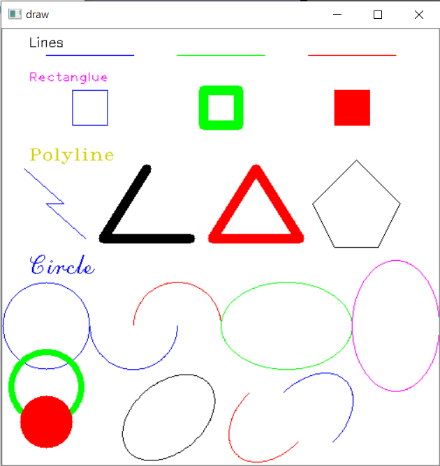

<br/>

### 3. Numpy 배열로 이미지 생성

<br/>

#### 흑백 이미지 만들기

흑백(grayscale) 이미지는 2차원 배열로 만들 수 있다.  **0,1번 축은 (y,x)좌표 값이 저장되고** 2차원의 한 점은 0~255의 정수값을 가진다.

* Numpy로 원하는 가로, 세로 크기만큼의 배열을 만들되, 초기값으로 0을 넣어준다. (np.zeros())
* 원하는 좌표에 값을 할당하면 그 값 만큼의 밝기를 가진 점으로 바뀐다.
* 막대 모양의 선을 그려주기 위해 슬라이싱 기능을 사용한다.
    * img[25:35, :] = 45
        * 0번축(height - y축)의 25~34번째,
        * 1번축(width - x축)의 모든 위치
        * 어두운 회색(45)
        * 10 픽셀 두께의 어두운 가로막대가 위에서 26번째 픽셀 위치에 만들어진다.
    * img[:, 35:45] = 205
        * 10 픽셀 두께의 밝은 세로막대가 왼쪽에서 36번째 픽셀 위치에 만들어진다.
* 화면에 보여주기 위해 OpenCV의 imshow() 함수를 사용한다

<br/>

* 예제 코드

```python
import cv2
import numpy as np

img = np.zeros( (120, 120), dtype=np.uint8)
img[25:35, :] = 45
img[55:65, :] = 115
img[85:95, :] = 160
img[:, 35:45] = 205
img[:, 75:85] = 255

cv2.imshow('Gray', img)
cv2.waitKey(0)
cv2.destroyAllWindows()
```

* 결과

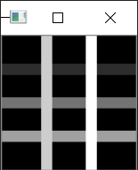

<br/>

#### 컬러 이미지 만들기
컬러 이미지는 3차원 배열로 만들 수 있다. **0,1번 축은 (y,x)좌표 값이 저장되고**, 2번축은 RGB 컬러값이 저장된다.

* Numpy로 원하는 가로, 세로 크기만큼의 배열을 만들되, 초기값으로 0을 넣어준다.(np.zeros())
* 2번 축은 RGB 컬러이므로 크기는 항상 3이다.
* 0,1번축의 원하는 좌표에 3개의 컬러값을 가진 리스트를 할당하면 그 값의 컬러를 가진 점으로 바뀐다.
* 막대 모양의 선을 그려주기 위해 슬라이싱 기능을 사용한다.
    * img[25:35, :] = [255, 0, 0]
        * 0번축(height)의 25~34번째,
        * 1번축(width)의 모든 위치
        * 밝은 파란색(255,0,0): OpenCV로 보여주기 때문에 BGR 순서가 된다
        * 10 픽셀 두께의 파란 가로막대가 위에서 26번째 픽셀 위치에 만들어진다.
    * img[:, 35:45] = [255, 255, 0]
        * 10 픽셀 두께의 시안(cyon)색 세로막대가 왼쪽에서 36번째 픽셀 위치에 만들어진다.
* 화면에 보여주기 위해 OpenCV의 imshow() 함수를 사용한다

<br/>

* 예제 코드

```python
import numpy as np
import cv2

img = np.zeros((120,120,3), dtype = np.uint8)
img[25:35, :] = [255, 0, 0] # Blue x축의 범위, y축의 범위.
img[55:65, :] = [0, 255, 0]
img[85:95, :] = [0, 0, 255]
img[:, 35:45] = [255, 255, 0]
img[:, 75:85] = [0, 255, 255] # Red 곰곰히 생각하며 따라가보자\
cv2.imshow('RGB', img)
cv2.waitKey(0)
cv2.destroyAllWindows()
```

* 결과

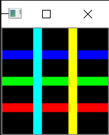

<br/>

#### 사각형 그리기
슬라이싱으로 0,1번축의 범위를 정해주고 값을 할당하면 사각형이 만들어진다.
* img[25:35, 35:45] = [255,0,0]
    * 한 변의 길이가 10픽셀인 파란색 정사각형이 (25,35) 위치에 만들어진다.

<br/>

* 예제 코드

```python
img = np.full((120,120,3), 255, dtype = np.uint8)
img[25:45, 35:55] = [255, 255, 0] # Blue x축의 범위, y축의 범위.

cv2.imshow('RGB', img)
cv2.waitKey(0)
cv2.destroyAllWindows()
```

* 결과

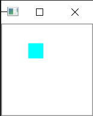

<br/>

#### ** X자 그리기
* for문을 이용하여 0번축의 인덱스 값을 1씩 증가시키고, 1번축의 인덱스는 일정 폭을 유지하면서 1씩 증가시키면, 대각선 방향의 막대를 그릴 수 있다.

<br/>

* 예제 코드

```python
import numpy as np
import cv2

img = np.full((120,120,3), 255, dtype = np.uint8)
for i in range(10,110):
    img[i, i-5:i+5] = [255, 0, 0]
    img[i, 115-i:125-i] = [255, 0, 0]

cv2.imshow('RGB', img)
cv2.waitKey(0)
cv2.destroyAllWindows()
```

* 결과

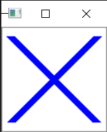

<br/>

### 실습 과제2) Drawing Union Jack

* 영국 국기인 Union Jack을 그리는 실습

<br/>

* 예제 코드

```python
import numpy as np
import cv2

img = np.full((120, 120, 3), 255, dtype=np.uint8)

img[10:110, :] = [126, 34, 1] # 사각형
for i in range(10, 110):
    img[i, i-10:i+10] = [255, 255, 255] # x=-y 그래프 모양 하얀 선
    img[i, i-5:i+5] = [0, 0, 255] # x=-y 그래프 모양 빨간 선
    img[i, 110-i:130-i] = [255, 255, 255] # x=y 그래프 모양 하얀 선
    img[i, 115-i:125-i] = [0, 0, 255] # x=y 그래프 모양 빨간 선
    img[i, 50:70] = [255, 255, 255] # y 그래프 모양 하얀 선
    
for i in range(0, 120):
    img[50:70, i] = [255, 255, 255] # x 그래프 모양 하얀 선
    img[55:65, i] = [0, 0, 255] # x 그래프 모양 빨간 선

for i in range(10, 110):
    img[i, 55:65] = [0, 0, 255] # y 그래프 모양 빨간 선

cv2.imshow('Union Jack', img)
cv2.waitKey(0)
cv2.destroyWindow('Union Jack')
```

* 결과

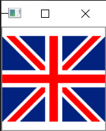

<br/>

### 2.3 창관리

```python
import cv2
img = cv2.imread('img/jiheon.jpg')
img_gray = cv2.imread('img/jiheon.jpg', cv2.IMREAD_GRAYSCALE)

cv2.namedWindow('origin', cv2.WINDOW_AUTOSIZE) # 이미지에 맞추어 윈도우 크기 조잘
cv2.namedWindow('gray', cv2.WINDOW_NORMAL) # 기본으로 주어지는 크기로 이미지 출력

cv2.imshow('origin', img)
cv2.imshow('gray', img_gray)

cv2.moveWindow('origin', 0,0) # 좌측 상단
cv2.moveWindow('gray', 100,100) # 100,100 위치로 이동
cv2.waitKey(0) # pause와 같은 역할. key 입력 대기

cv2.resizeWindow('origin', 300,400)
cv2.resizeWindow('gray', 200,300)
cv2.waitKey(0)

cv2.destroyWindow('gray')

cv2.waitKey(0)
cv2.destroyAllWindows()
```

<br/>

### 2.4 이벤트 처리

<br/>

#### 2.4.1 키보드 이벤트

```python
# 상하좌우 키입력
import cv2
img = cv2.imread('img/jiheon.jpg')
title = 'IMG'
x, y = 100, 100

while True:
    cv2.imshow(title, img) # 이미지 보여주기
    cv2.moveWindow(title, x, y) # 윈도우 창 옮기기
    key = cv2.waitKey(0) & 0xFF
    # 안전장치로 비트엔드 연산. 맨 마지막 값만 넘기는 것?
    print(key, chr(key)) # chr은 해당 값을 알파벳으로 바꿔준다.
    if key == ord('h'): # ord는 아스키 값으로 바꿔준다.
        x-=10
    elif key == ord('j'):
        y-=10
    elif key == ord('k'):
        x+=10
    elif key == ord('l'):
        y+=10
    elif key == ord('q') or key == 27: # q 또는 ESC 키
        cv2.destroyAllWindows()
        break
```

<br/>

#### 2.4.2 마우스 이벤트
마우스 컨트롤을 위해서는 콜백(callback) 함수를 사용해야 한다. 콜백 함수 동작에 대해서는 Python, C++, Java 언어 고급과정에서 다룬다. 이에 대한 지식이 없거나 부족한 학생은 해당 언어 교재를 참고하기 바란다.

콜백 함수는 이벤트 기반 프로그래밍의 하나로, 이벤트에 따라 동작하는 함수를 미리 선언해두고 해당 이벤트가 발생할 때마다 함수가 실행되도록 하는 기법이다. 이렇게 하면 이벤트와 관련된 연동을 프로그램 흐름 상에서 관리할 필요가 없기 때문에 알고리즘을 구현하기 편리하다.

```python
# 마우스 이벤트
import cv2

title = 'mouse event'
img = cv2.imread('img/blank_500.jpg')
cv2.imshow(title, img)


def onMouse(event, x, y, flags, param): # 마우스 콜백 함수
    print(event, x, y)
    if event == cv2.EVENT_LBUTTONDOWN: # 책 53p 해봐~
        cv2.circle(img, (x,y), 30, (0,0,0), -1)
        cv2.imshow(title, img)
    
cv2.setMouseCallback(title, onMouse) # 마우스 콜백 함수를 설정한다.

while True:
    if cv2.waitKey(0) & 0xFF == 27: # ESC 눌러야 빠져나온다
        break
        
cv2.destroyAllWindows()
```

<br/>

```python
# 마우스 + 플래그 이벤트
import cv2

title = 'mouse event'
img = cv2.imread('img/blank_500.jpg')
cv2.imshow(title, img)

colors = {'black': (0,0,0),
         'red': (0,0,255),
         'blue': (255,0,0),
         'green': (0,255,0),}

def onMouse(event, x, y, flags, param): # 마우스 콜백 함수
    print(event, x, y, flags)
    color = colors['black']
    if event == cv2.EVENT_LBUTTONDOWN:
        if flags & cv2.EVENT_FLAG_CTRLKEY and flags & cv2.EVENT_FLAG_SHIFTKEY:
            color = colors['green']
        elif flags & cv2.EVENT_FLAG_SHIFTKEY:
            color = colors['blue']
        elif flags & cv2.EVENT_FLAG_CTRLKEY:
            color = colors['red']
        cv2.circle(img, (x,y), 30, color, -1)
        cv2.imshow(title, img)

cv2.setMouseCallback(title, onMouse) # 마우스 콜백 함수를 설정한다.

while True:
    if cv2.waitKey(0) & 0xFF == 27: # ESC 눌러야 빠져나온다
        break
        
cv2.destroyAllWindows()
```

<br/>

<br/>

## 4. 이미지 프로세싱 기초

### 4.1 관심 영역(ROI)

* ROI (Region of Interest)  # rectangle 형태를 이야기 함!!

<br/>

#### 4.1.1 관심영역 지정

```python
# 내 own 값 ㅋㅋㅋ
import cv2
import numpy as np

img = cv2.imread('img/jiheon.jpg')
x = 320; y = 150; w = 50; h = 50
roi = img[y:y+h, x:x+w] # numpy는 copy가 아닌 referencing!!
cv2.rectangle(roi, (0,0), (w-1, h-1), (0,255,0)) # BGR 순서
img[y:y+h, x+w:x+w+w] = roi
cv2.imshow('img', img)
cv2.imwrite('img/jiheon_roi.jpg', roi)

cv2.waitKey(0)
cv2.destroyAllWindows()
```

<br/>

* 영역 지정하여 복사 붙여넣기

```python
# 영역 복사 붙여넣기
import cv2
import numpy as np

img = cv2.imread('img/jiheon.jpg')
x = 110; y = 100; w = 300; h = 300
roi = img[y:y+h, x:x+w] # numpy는 copy가 아닌 referencing!!
cv2.rectangle(roi, (0,0), (w-1, h-1), (0,255,0)) # BGR 순서
cv2.imshow('img', img)

cv2.waitKey(0)
cv2.destroyAllWindows()
```

<br/>

#### 4.1.2 마우스로 관심영역 지정

* 마우스 이벤트
    * cv2.EVENT_LBUTTONDOWN : 누르기
    * cv2.EVENT_LBUTTONUP : 떼기
    * cv2.EVENT_MOUSEMOVE : 움직이기
        * 드래그란, 누르고 유지하고 당기고 떼고!
        * 윈도우는 마우스를 계~속 처리하고 있는거다.

<br/>

```python
# 드래그 영역 네모 그리기
import cv2
import numpy as np

isDragging = False # 눌린 상태 여부
pos = (-1, -1) # x0, y0
w, h = -1, -1 # init


def onMouse(event, x, y, flags, param):
     # global을 쓰면 local이 아닌 함수 바깥의 변수 사용
    global isDragging, pos, w, h, img
    if event == cv2.EVENT_LBUTTONDOWN:
        isDragging = True
        pos = (x,y)
    elif event == cv2.EVENT_MOUSEMOVE:
        if isDragging:
            img_draw = img.copy() # 보통 처리할 때는 원본이 아닌 카피 후 진행
            cv2.rectangle(img_draw, pos, (x,y), (255,0,0), 2)
            cv2.imshow('img_draw', img_draw)
    elif event == cv2.EVENT_LBUTTONUP:
        if isDragging:
            isDragging = False
            w = x - pos[0]
            h = y - pos[1]
            if w > 0 and h > 0:
                img_draw = img.copy()
                cv2.rectangle(img_draw, pos, (x,y), (0,255,0), 2)
                cv2.imshow('img_draw', img_draw)
                roi = img[pos[1]:pos[1]+h, pos[0]:pos[0]+w]
                cv2.imshow('cropped', roi)
                cv2.imwrite('img/cropped.jpg', roi)
            else:
                cv2.imshow('img_draw', img)

                
img = cv2.imread('img/jiheon.jpg')
cv2.imshow('img', img)
cv2.setMouseCallback('img', onMouse)

cv2.waitKey(0)
cv2.destroyAllWindows()
```

<br/>

#### 하지만 openCV로 하면, 위 많은 것들을.. 알아서 다 해준다

ret = cv2.**selectROI**([win_name,] img [, showCrossHair = True, fromCenter = False])

* win_name: ROI 선택을 진행할 창의 이름, str
* img: ROI 선택을 진행할 이미지, NumPy ndarray
* showCrossHair: 선택 영역 중심에 십자모양 표시 여부
* fromCenter: 마우스 클릭 시작지점을 영역의 중심으로 지정
* ret: 선택한 영역 좌표와 크기(x,y,w,h), 선택을 취소한 경우 모두 0
        

영역 선택 후, 스페이스나 엔터키를 누르면 좌표와 크기값이 반환되고, 'c'키를 누르면 선택이 취소되고, 리턴값이 0이 된다.

<br/>

* 드래그 영역에 네모 그리기

```python
# 드래그 영역 네모 그리기
import cv2
import numpy as np
               
img = cv2.imread('img/jiheon.jpg')
x,y,w,h = cv2.selectROI('img', img, False)
if w and h:
    roi = img[y:y+h, x:x+w]
    cv2.imshow('cropped', roi)
    cv2.imwrite('img/cropped2.jpg', roi)
    
cv2.imshow('img', img)

cv2.waitKey(0)
cv2.destroyAllWindows()
```

<br/>

<br/>

<br/>