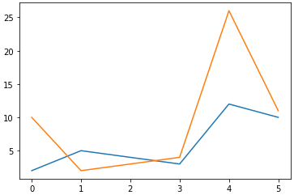
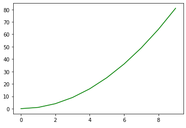
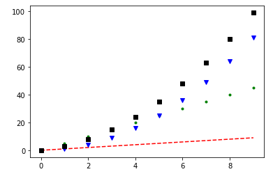
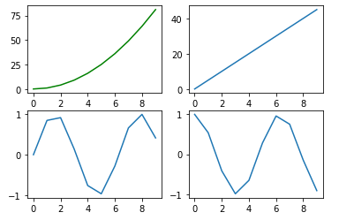
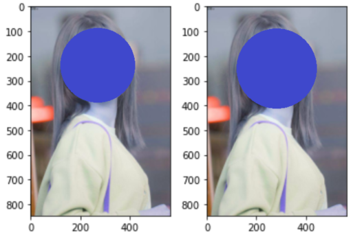

# 영상처리 프로그래밍

<br/>

## 개발 환경 및 파이썬 문법 소개

### jupyter 단축키

* jupyter에서 쓰는 파일 확장자는 .ipynb (i python notebook)!

* a, b : 위, 아래에 명령창 생성
* p : 명령들 모음
* h : 단축키 모음

<br/>

Numpy라는 라이브러리를 많이 사용할 듯

<br/>

### # 비슷한 점

* 함수, 클래스..
* if, for, while...

<br/>

### # 파이썬이 C/C++/Java와 다른점!

* 내부 자료구조를 가지고 있다.
* 표기법
* 기본적으로 ; 세미콜론을 붙이지 않는다.
* print()
  * 한 줄에 문장 두 개 이상을 표현할 때 사용한다.
  * print("Hello", end=""); print("World")
  * 기본적으로 \n를 포함한다.
* whlie i<10:
  * 문장이 두 줄 이상인 명령일 때 마지막에 콜론을 붙인다.
* { } 를 쓰지 않는다. 대신에 공백으로 구분한다.
* 기본적으로 변수 타입을 써주지 않는다.
  * Dynamic typing 방식.
  * i = 5
* ++ 와 같은 증감 연산자는 없다. +=1 로 하자.
* 한줄 주석은 #으로, 여러 줄 주석은 ''' ''' 또는 """ """으로 한다.
  * 프로그램이나 함수 등에 여러 줄 주석으로 써주면 Doc 내용이 된다~
* str 타입도 존재한다!

<br/>

### # 파이썬의 4가지 자료구조

* 시퀀스형(연속적)
  * list
    * [] 사용
    * 인덱스마다 접근가능 (순서가 있음)
    * 수정 가능
    * 요소마다 타입 달라도 가능
  * tuple
    * () 사용
    * 인덱스마다 접근가능
    * 수정 불가
    * 대신 list보다 접근 속도가 빠름
  * string
    * 튜플하고 비슷한 성격.
    * 인덱스마다 접근가능
    * 수정 불가
  * range()
    * for 문에서 사용이 많이 됨
    * range(1, 10, 2)
    * 1부터 시작해서 10 직전(9)까지 포함, 2씩 증가

<br/>

* 아닌것
  * dictionary
    * {} 사용
    * 인덱스로 접근 불가 (순서가 없음)
    * 예) d = {'a':1, 'b':2, 'c':10, 'z':100, 'p':50.4, 'q':'abc'}
    * {키:값 ... } 형태를 가짐
    * 키는 당연히 바뀌면 안됨 (따라서 튜플은 키로 쓸 수 있지만, 리스트는 불가능)
    * 요소마다 타입 달라도 가능
    * 예) key['a'] - 접근할 때 필요한 인덱스가 key 이름이라고 생각하면 될 듯. 
  * set
    * {} 사용
    * e = {1, 2, 3, 1}  # e의 원소는 1, 2 , 3 - 중복된 원소는 존재하지 않음
    * 인덱스로 접근 불가 (순서가 없음)

<br/>

* 그 외
  * a in b : a에 b가 들어있는지를 확인하여 반환. True / False return type을 가짐
  * 리스트, 튜플, 스트링 등 '+' 연산 가능 (range는 불가능)
  * len(a)
  * 슬라이싱 [start : end : step]
  * element / item 두 개의 차이!!

### # 함수

* int, float, str, list, tuple, dict, set, range

<br/>

### # 리스트의 메소드

* append() : 맨 끝에 요소 추가
* extend() : 리스트 확장
* insert() : 특정 인덱스에 요소 추가
* pop() : 요소 추가
* remove() : 특정 값을 찾아서 요소 삭제
* index() : 특정 값의 인덱스 찾기
* reverse() : 순서 뒤집기
* clear() : 모든 요소 삭제
* copy() : 리스트 복사

<br/>

### # 딕셔너리 메소드

* setdefault() : 키-값 쌍 추가
* update() : 특정 키의 값을 수정
* pop() : 키-값 쌍 삭제 후 값을 반환
* popitem() : 키-값 쌍 삭제 후 쌍을 튜플로 반환
* clear() : 모든 요소 삭제
* get() : 특정 키의 값 가져오기
* items() : 모든 키-값 쌍을 가져오기
* keys() : 모든 키를 가져오기
* values() : 모든 값을 가져오기
* fromkeys() : 키 리스트로 딕셔너리 생성 --> dict 클래스 메소드

<br/>

### # 제어문

* if, elif, else
* while

<br/>

### # 함수

* def():

<br/>

### # 클래스

```python
class Person:
    
    def greeting(self):
        print("Hello")
        
    def greeting2(self, who):
        print("Hello, ", who)
        
    def __init__(self, name, age):
        self.name = name
        self.age = age
        
    def whoami(self):
        print("I'm %s, I'm %d" %(self.name, self.age))
        
        
james = Person("James", 21)
james.greeting()
james.greeting2("sanggoe")
james.whoami()
        
        
        
class Student(Person):
    def __init__(self, name, age, grade=1):
        super().__init__(name, age)
        self.grade = grade
        
    def whoami(self):
        super().whoami()
        print("I am a student and my grade {0}".format(self.grade))
        
        
peter = Student("Peter", 22)
peter.greeting()
peter.whoami()
```

<br/>

### # import 이용하기

* 모듈 또는 객체 등을 불러 사용하기 위한 명령

```python
import random
print(random.randint(1,10))
```

```python
from math import floor as cut
print(cut(3.4))
```

```python
file = open("sample.txt", mode="w", encoding='utf-8')
file.write("Hello, world\n")
file.write("안녕하세요\n")
file.close()
```

```python
with open("sample.txt", encoding='utf-8') as file:
    print(file.read())
```

<br/>

### # 고급 문법

* 컴프리헨션(comprehension)
* 람다(rambda) 표현식
* 클로저(closer)
* 이터레이터(iterator)
* 제너레이터(generator)
* 코루틴(coroutine)
* 데코레이터(decorator)

<br/>

<br/>

## 3장 - NumPy와 Matplotlib

* 하나의 데이터에는 하나의 타입만 사용하고, 대신 속도를 빠르게 하자는 목적

<br/>

### 이미지와 NumPy

```python
import cv2
img = cv2.imread('img/jiheon.jpg')
print(type(img))
```

* .imread() : NumPy 배열을 반환하는 함수
* OpenCV를 파이썬으로 프로그래밍 한다는 것은 NumPy 배열을 다룬다는 것과 같다!

<br/>

### ndarray의 기본 속성

* Numpy 배열은 기본 자료구조로 ndarray라는 배열을 사용한다.
* ndarray의 기본 속성은다음과 같다.
   * **ndim**: 차원(축)의 수
      * Color면 3개일 것
   * **shape**: 각 차원의 크기 (튜플형태)
      * (가로, 세로, 차원의 수)
      * 차원은 흑백이면 1일 수 있지만 Color면 3개일 것
   * **size**: 전체 요소의 수
      * shape의 각 요소의 곱.
      * 가로 * 세로 * Color의 수
   * **dtype**: 요소의 데이터 타입
      * 기본적으로 정수
   * **itemsize**: 각 요소의 바이트 크기
      * 기본적으로 1byte

<br/>

### Numpy 배열 생성

#### 모듈 참조 선언

* 일반적으로 다음과 같이 쓴다.

```python
import numpy as np
```

<br/>

#### 배열 생성 - 값으로 생성

* numpy.**array**(list [, dtype]) : 지정한 값들로 NumPy 배열 생성

  * ```python
    a = np.array([1,2,3,4], np.uint8)
    ```

  * list : 배열 생성에 사용할 값을 가진 파이썬 리스트 객체

  * dtype : 데이터 타입 (생략시 값에 따라 자동 할당)

    * OpenCV에서 주로 쓰는 dtype은 unit8, int8, float32 정도
    * 정수, 실수 형태로 list를 준 경우, 큰 값을 기준으로 결정된다. (이 경우, 실수 float형으로)

* numpy.**unit8**([1,2,3,4])

  * ```python
    a = np.unit8([1,2,3,4])
    ```

  * dtype을 지정해줘야 하는 경우, 위와 같이 아예 해당 dtype으로 호출하는 함수도 정의되어 있다. 

<br/>

#### 배열 생성 - 크기와 초기 값으로 생성

* **dtype을 지정해 주지 않으면 default 값은 float64를 지정한다.**

* numpy**.empty**(shape, [, dtype])  : 초기화되지 않은(쓰레기) 값

  * ```python
    a = np.empty((2,3), np.uint8)
    ```

  * shape : **튜플 형태**로, 배열의 각 차수 크기 지정

* numpy**.zeros**(shape, [, dtype])  : 0으로 초기화

  * ```python
    a = np.zeros((2,3))
    ```

* numpy**.ones**(shape, [, dtype])  : 1로 초기화

  * ```python
    a = np.ones((2,3), 'float64')
    ```

* numpy**.full**(shape, fill_value, [, dtype])  : fill_value로 초기화

  * ```python
    a = np.full((5,5), 255)
    ```

<br/>

#### 생성된 배열 초기화

* **.fill**(value) : 배열의 모든 요소를 value로 채움

  * ```python
    a = np.empty((3,3))
    a.fill(255)
    ```

<br/>

#### 기존 배열의 크기와 같은 배열 생성

* numpy**.empty_like**(array [, dtype]) : array와 같은 shape, dtype을 가진 초기화되지 않은 배열 생성

  * ```python
    b = np.empty_like(a, np.uint8)
    ```

* numpy**.zeros_like**(array [, dtype]) : array와 같은 shape, dtype을 가진 0으로 초기화 된 배열 생성

  * ```python
    b = np.zeros_like(a)
    ```

* numpy**.ones_like**(array [, dtype]) : array와 같은 shape, dtype을 가진 1로 초기화 된 배열 생성

  * ```python
    b = np.ones_like(a, 'uint8')
    ```

* numpy**.full_like**(array, fill_value [, dtype]) : array와 같은 shape, dtype을 가진 fill_value로 초기화 된 배열 생성

  * ```python
    b = np.full_like(a, 255, np.uint8)
    ```

<br/>

#### 시퀀스와 난수로 생성

* numpy.**arange**([start=0, ] stop [, step=1, dtype=float64]) : 순차적인 값으로 생성

  * ```python
    a = np.arange(5)
    b = np.arange(0, 10, 2, 'float64')
    ```

  * 형식은 range 함수와 매우 유사하다.

  * start : 시작 값

  * stop : 종료 값 (stop은 미포함, -1 까지)

  * step : 증가 값

  * dtype : data type

* numpy.**random**.**rand**([d0 [d1 [ ..., dn]]]) : 0과 1 사이의 무작위 수 생성

  * ```python
    a = np.random.rand(2,3)
    ```

  * rand () 안의 내용은 배열의 모양 shape을 입력한다.

  * 예를 들어 rand(2,3) : shape이 (2,3)인 배열에 0~1 사이의 무작위 수를 넣어 생성

* numpy.**random**.**randn**([d0 [d1 [ ..., dn]]]) :" 0과 1 사이의 무작위 수 생성 : 표준정규분포(평균 : 0, 분산 : 1)를 따르는 무작위 수로 생성

  * ```python
    a = np.random.randn(2,3)
    ```

<br/>

#### dtype 변경 - 배열의 데이터 타입 변경

* ndarray.astype(dtype)

  * ```python
    b = a.astype(np.float64)
    or
    b = a.astype('float64')
    ```

  * dtype : 변경하고 싶은 dtype. 문자열 또는 dtype

    * 'float64' 또는 np.float64 등으로 값을 주면 됨

* numpy.uintXX(array) : array를 uintXX 타입으로 변경해서 반환

* numpy.intXX(array) : array를 intXX 타입으로 변경해서 반환

* numpy.floatXX(array) : array를 floatXX 타입으로 변경해서 반환

* numpy.complexXX(array) : array를 complexXX 타입으로 변경해서 반환

  * ```python
    b = np.uint8(a)
    c = np.int32(a)
    d = np.float64(a)
    e = np.complex64(a)
    ```

<br/>

#### 차원 변경

* ndarray.**reshape**(newshape) : ndarray의 shape를 newshape로 차원 변경

  * ```python
    a = np.arange(6)
    a.reshape(2,3)
    ```

  * 바꾸려는 ndarray 배열의 내부함수

  * newshape : 변경하려는 튜플형식의 새로운 shape

* numpy.**reshape**(ndarray, newshape) : ndarray의 shape를 newshape로 차원 변경

  * ```python
    b = np.reshape(a, (2,3))
    ```

  * numpy의 내부함수

  * ndarray : 원본 배열 객체

* Tip! newshape를 입력할 때, 남은 하나에 -1을 넣으면 알아서 계산해서 값을 넣어준다.

  * ```python
    a = np.arange(6)
    b = a.reshape(2,-1)
    or
    b = np.reshape(a, (-1, 2))
    ```

* numpy.**ravel**(ndarray) : 1차원 배열로 차원 변경

  * ```python
    a = np.reshape(np.arange(6), (2,3))
    b = np.ravel(a)
    or
    b = a.reshape(-1)
    ```

* ndarray.**T** : 전치배열(transpose) 만들기

  * ```python
    b = a.T
    ```

<br/>

### 브로드 캐스팅 연산

* 차원이 다른 배열끼리 연산이 가능하게 해주는 것

<br/>

#### 배열과 스칼라 값 사이의 연산

* NumPy 배열과 스칼라 값 간의 여러 가지 연산이 가능하다.

  * ```python
    a = np.arange(4) # array[1,2,3,4]
    a+1 # array[2,3,4,5]
    a-1 # array[1,2,3,4]
    a*2 # array[2,4,6,8]
    a/2 # array[1,2,3,4]
    a**2 # array[1,4,9,16]
    a > 2 # array[False,True,True,True]
    ```

<br/>

#### 배열끼리의 연산

* 배열끼리의 연산도 가능하다.

  * ```python
    a = np.arange(10, 60, 10) # array[10,20,30,40,50]
    b = np.arange(1,6) # array[1,2,3,4,5]
    a+b = [11,22,33,44,55]
    a-b = [9,18,27,36,45]
    a*b = [10,40,90,160,250]
    a/b = [10.,10.,10.,10.,10.]
    a**b = [10,400,27000,2560000,312500000]
    ```

<br/>

#### 브로드 캐스팅 조건

* **Shape이 똑같은** 두 배열끼리의 연산은 아무 문제 없다.

  * 위 배열끼리의 연산에서 예시와 같다.

* 다른 경우, **둘 중 하나가 1차원**이면서 **배열의 열의 개수가 같아야** 한다.

  * ```python
    a = np.arange(3)
    b = np.arange(6).reshape(2,3)
    c = np.arange(27).reshape(3,3,3)
    # 위와 같은 경우 a와 b, a와 c 연산 가능
    ```

<br/>

#### 규칙!

* 규칙 1: 두 배열의 차원 수가 다르면 더 작은 수의 차원을 가진 배열 shape의 앞쪽(왼쪽)을 1로 채운다.

* 규칙 2: 두 배열의 shape이 어떤 차원에서도 일치하지 않는다면 해당 차원의 shape이 1인 배열이 다른 shape과 일치하도록 늘어난다.

* 규칙 3: 임의의 차원에서 크기가 일치하지 않고 1도 아니라면 오류가 발생한다.

  * ```python
    # shape로 비교 예시
    (2,3,4) + (1,3,4) --> (2,3,4)
    (2,3,4) + (3,1) --> (2,3,4) + (1,3,1) --> (2,3,4)
    (1,3,4) + (3,3,1) --> (3,3,4) + (3,3,4)
    
    (2,4,5) + (1,4) --> (2,4,5) + (1,1,4) --> (2,4,5) + (2,4,4) # 오류 발생, 연산 불가!
    ```

<br/>

### 인덱싱과 슬라이싱

* 인덱싱은 말 그대로 인덱스 번호에 직접 접근하는 것을 말한다.

  * ```python
    a = np.arange(12).reshape(3,4)
    a[0][2] = 0 # (0,2) 위치의 요소 하나의 값을 0으로 변경
    a[1] = 1 # a의 두 번째 행의 모든 요소의 값을 1로 변경
    ```

* 파이썬에서 슬라이싱을 하면 '복사' 되어 저장되지만, NumPy에서는 속도와 메모리 등 최적화를 위해 레퍼런싱이 된다. 즉, 원본이 슬라이싱 되는 것이다.

  * ```python
    b = a[0:2, 1:3] # a[0][1], a[0][2], a[1][1], a[1][2] 레퍼런싱
    b[0,0] = 100 # a[0][1]의 값이 100으로 바뀜
    ```

* ndarray.**copy**() : 복제본을 얻기 위한 함수

  * ```python
    b = a.copy()
    ```

<br/>

### 팬시 인덱싱

* 인덱스에 다른 배열을 전달해서 원하는 요소를 선택하는 방법을 말한다.

* 숫자를 포함하면 인덱스에 맞게 선택

  * ```python
    a = np.arange(3,8) # array[3,4,5,6,7]
    a[[1,3,4]] # array[4,6,7] - 해당 인덱스의 요소들 선택
    ```

  * ```python
    a = np.arange(30).reshape(5,6)
    a # array([[ 0,  1,  2,  3,  4,  5],
      #        [ 6,  7,  8,  9, 10, 11],
      #        [12, 13, 14, 15, 16, 17],
      #        [18, 19, 20, 21, 22, 23],
      #        [24, 25, 26, 27, 28, 29]])
    
    a[3,4] # 22
    a[[3],[4]] # array([22])
    a[[0,2],[2,3]] # array([2, 15])
    ```

  * ```python
    b = np.arange(30).reshape(2,5,3)
    b # array([[[ 0,  1,  2],
      #         [ 3,  4,  5],
      #         [ 6,  7,  8],
      #         [ 9, 10, 11],
      #         [12, 13, 14]],
      #
      #        [[15, 16, 17],
      #         [18, 19, 20],
      #         [21, 22, 23],
      #         [24, 25, 26],
      #         [27, 28, 29]]])
    
    b[[0,1],[2,3],[1,2]] # array([7,26])
    b[[0,1,0,0,1], np.arange(5), np.random.randint(0,3,(5,))]
    # array([0~2,18~20,6~8,9~11,27~29])
    ```

* boolean 값을 포함하면 True인 값을 선택

  * ```python
    a[[True, False, True, False, True]] # array[3,5,7]
    a > 5 # array[False, False, False, True, True]
    a[(a>5)] # array[6,7]
    ```

<br/>

### 병합과 분리

#### 병합

* 어느 방향으로 붙여 나가느냐? 기준으로!

* ```python
  a = np.arange(4).reshape(2,2)
  a
  
  array([[0, 1],
        [2, 3]])
  
  b = np.arange(10,14).reshape(2,2)
  b
  
  array([[10, 11],
         [12, 13]])
  ```

* numpy.**hstack**(arrays) : 수평으로 병합, arrays는 병합 대상 배열(튜플형태로 넣어야 함)

  * ```python
    np.hstack((a,b)) # 영상처리에서 이미지 두 개를 가로로 연속으로 붙이고 싶을 때 쓸 수 있다.
    
    array([[ 0,  1, 10, 11],
           [ 2,  3, 12, 13]])
    # shape은 (2,2) 에서 (2,4)가 되었다.
    ```

* numpy.**vstack**(arrays) : 수직으로 병합

  * ```python
    np.vstack((a,b))
    
    array([[ 0,  1],
           [ 2,  3],
           [10, 11],
           [12, 13]])
    # shape은 (2,2) 에서 (4,2)가 되었다.
    ```

* numpy.**concatenate**(array, [axis=]0) : 지정한 축 기준으로 병합

  * ```python
    np.concatenate((a,b), 0) # 0번째 축 기준. vstack과 같고, 1을 쓰면 hstack과 같다
    # 배열은 왼쪽에서부터. 차원은 오른쪽에서부터
    ```

* numpy.**stack**(arrays, axis = 0) : 배열을 새로운 축으로 병합

  * ```python
    np.stack((a,b), 0)
    
    array([[[ 0,  1],
            [ 2,  3]],
    
           [[10, 11],
            [12, 13]]])
    # shape은 (2,2) 에서 (2,2,2)가 되었다.
    ```

<br/>

#### 분리

* 나누기 위해 칼질하는 방향이 아니라, 칼질 함으로서 **나누어지는 배열이 수평으로 나뉘느냐 수직으로 나뉘느냐이다**! 헷갈리지 말자. 예를 들어, 수직(vertical) 방향으로 칼질하면 **수평(horizontal)으로** (왼쪽 | 오른쪽) **두동강** 난다. 이렇게 **수평으로 나뉘게 만드는 함수는 hsplit()** 이다. 병합과 반대라 헷갈린다. 또한, 나누어 떨어지는 숫자로 분리 가능하다.

* ```python
  a = np.arange(12)
  a
  
  array([ 0,  1,  2,  3,  4,  5,  6,  7,  8,  9, 10, 11])
  
  b = np.arange(12).reshape(4,3)
  b
  array([[ 0,  1,  2],
         [ 3,  4,  5],
         [ 6,  7,  8],
         [ 9, 10, 11]])
  ```

* numpy.**vsplit**(arrays) : array 배열을 **수평 축 기준으로** 위 아래(vertical)를 분리

  * ```python
    np.vsplit(b, 2) # 칼질을 가로로 샥!! 해서 위 아래로 나누는 함수이다.
    [array([[0, 1, 2],
            [3, 4, 5]]),
     array([[ 6,  7,  8],
            [ 9, 10, 11]])]
    ```

* numpy.**hsplit**(arrays) : array 배열을 **수직 축 기준으로** 좌 우를(horizontal) 분리

  * ```python
    np.hsplit(a, 2)
    [array([0, 1, 2, 3, 4, 5]), array([ 6,  7,  8,  9, 10, 11])]
    
    np.hsplit(a, 3)
    [array([0, 1, 2, 3]), array([4, 5, 6, 7]), array([ 8,  9, 10, 11])]
    
    np.hsplit(a, 5) # 나누어 떨어지는 숫자로 해야함. Error
    ```

  * ```python
    np.hsplit(a, [2, 5]) # 인덱스 위치 기준으로 나누고 싶을 때!
    [array([0, 1]), array([2, 3, 4]), array([ 5,  6,  7,  8,  9, 10, 11])]
    
    np.hsplit(b, [2])
    
    # 부가 설명을 적어놓아야 되겠다.
    array([[ 0,  1,  2],
           [ 3,  4,  5],
           [ 6,  7,  8], # 왼쪽 b의 경우 [2]인덱스를 기준으로 나누고 싶을 때
           [ 9, 10, 11]])
    
    array([[ 0,  1, | 2],
           [ 3,  4, | 5], # 스샤샤샥..! 이렇게 자른다. 그럼 수평으로 뎅강 잘리겠지?
           [ 6,  7, | 8], # 그럼 일단 크게 왼쪽 그룹과 오른쪽 그룹으로 나뉠 것이다.
           [ 9, 10, |11]]) 
    
    [array([[ 0,  1],
            [ 3,  4],
            [ 6,  7], # 요로케. 왼쪽 그룹은 2개의 element를 가지고 있는 배열들이 될 것이고,
            [ 9, 10]]),
     array([[ 2],
            [ 5],	  # 오른쪽 그룹은 1개의 element를 가지고 있는 배열들이 될것이다.
            [ 8],
            [11]])]
    ```

* numpy.**split**(arrays, indice, [axis =] 0) : 배열을 axis축으로 분리

  * array : 분리할 배열

  * indice : 분리할 개수 또는 인덱스

  * axis : 기준 축 번호

  * ```python
    np.split(b, 2, 0) # b를 2개로 수직으로 분리 : vsplit과 같이 그룹이 위아래로 나뉠 것!
    [array([[0, 1, 2],
            [3, 4, 5]]),
     array([[ 6,  7,  8],
            [ 9, 10, 11]])]
    
    np.split(b, [2], 1) # b를 [2]기준으로 수평으로 분리 : hsplit과 같이 왼쪽[2개] 오른쪽[1개] 그룹으로 나뉠 것!
    [array([[ 0,  1],
            [ 3,  4],
            [ 6,  7],
            [ 9, 10]]),
     array([[ 2],
            [ 5],
            [ 8],
            [11]])]
    
    np.split(b, 2, 1) # b를 2개로 수평으로 분리 : Error! 반드시 나누어 떨어지는 숫자만 가능
    
    np.split(b,[1,2],1) # b를 [1,2]기준으로 수평으로 분리
    np.split(b, 3, 1) # b를 3개로 수평으로 분리. 위와 결과가 같다.
    [array([[0],
            [3],
            [6],
            [9]]),
     array([[ 1],
            [ 4],
            [ 7],
            [10]]),
     array([[ 2],
            [ 5],
            [ 8],
            [11]])]
    ```

<br/>

### 검색기능

```python
a = np.arange(12).reshape(3,4)
a

array([[ 0,  1,  2,  3],
       [ 4,  5,  6,  7],
       [ 8,  9, 10, 11]])
```

* ret = numpy.where(condition [, t, f]) : 조건에 맞는 요소 찾기

  * ret : return된 배열(튜플)

  * condition : 조건식

  * t : 조건에 맞는 값에 지정할 값이나 배열(조건과 같은 shape)

  * f : 조건에 틀린 값에 지정할 값이나 배열

  * ```python
    coords = np.where(a>6) # 조건에 해당하는 배열의 인덱스를 반환! 행값 열값 배열 따로!
    coords
    (array([1, 2, 2, 2, 2], dtype=int64), array([3, 0, 1, 2, 3], dtype=int64))
    
    # 위에 행,열 따로 나온 배열을 stack으로 합해서 좌표 정보를 얻을 수 있다
    np.stack((coords[0], coords[1]), 1) # 
    array([[1, 3],
           [2, 0],
           [2, 1],
           [2, 2],
           [2, 3]], dtype=int64)
    ```

* numpy.nonzero(array) : array에서 요소 중 0이 아닌 요소의 인덱스들을 반환(튜플)

  * ```python
    b = np.array([0,1,2,0,1,2])
    np.nonzero(b)
    (array([1, 2, 4, 5], dtype=int64),)
    
    c = np.array([[0,1,2],[1,2,0],[2,0,1]])
    c
    array([[0, 1, 2],
           [1, 2, 0],
           [2, 0, 1]])
    np.nonzero(c) # 행 인덱스 배열, 열 인덱스 배열을 반환
    (array([0, 0, 1, 1, 2, 2], dtype=int64),
     array([1, 2, 0, 1, 0, 2], dtype=int64))
    ```

* numpy.all(array [, axis]) : array의 모든 요소가 True인지 검색

  * array : 검색 대상 배열

  * axis : 검색 기준 축. 생략 시 모든 요소, 지정시 축 개수별로 결과 반환

  * ```python
    d = np.array([[[True, False, True, True],
                   [True, True, False, True],
                   [True, True, True, True]],
                  
                  [[True, True, True, True],
                   [True, False, True, True],
                   [True, True, True, True]]])
    d
    array([[[ True, False,  True,  True],
            [ True,  True, False,  True],
            [ True,  True,  True,  True]],
    
           [[ True,  True,  True,  True],
            [ True, False,  True,  True],
            [ True,  True,  True,  True]]])
    
    d.shape
    (2, 3, 4)
    
    np.all(d)
    False
    
    np.all(d, 0) # 0번축, 두 그룹의 같은 인덱스 위치에 있는 요소들이 모두 True인가?
    array([[ True, False,  True,  True], # 즉, [0,0,0]와 [1,0,0] 두 인덱스 모두 True인가?
           [ True, False, False,  True], # [0,0,1][1,0,1] 체크?, [0,0,2][1,0,2] 체크?..
           [ True,  True,  True,  True]]) # 이런식으로 모든 인덱스 위치를 다 비교하여 체크한 값
    
    np.all(d, 1) # 1번축, 각 그룹의 세로(행)로 같은 인덱스 위치끼리 비교하여 해당 요소가 모두 참?
    array([[ True, False, False,  True],
           [ True, False,  True,  True]])
    
    np.all(d, 2) # 2번축, 각 행에 들어있는 요소들 모두(4개)를 체크하며 모두 True인지 체크!
    array([[False, False,  True],
           [ True, False,  True]])
    # 되게 복잡하지만, 하나하나 따라가보면 어렵지 않다.
    ```

* numpy.any(array [, axis]) : array의 요소 중 하나라도 True가 있는지 검색

  * ```python
    np.any(d) # 한번에 요소 싹다 검사. 하나라도 True?
    True
    
    np.any(d, 1) # 1번축 기준으로 그룹지어서 검사. 하나라도 True?
    array([[ True,  True,  True,  True],
           [ True,  True,  True,  True]])
    ```

<br/>

### 통계 함수

```python
a = np.arange(12).reshape(3,4)
a
array([[ 0,  1,  2,  3],
       [ 4,  5,  6,  7],
       [ 8,  9, 10, 11]])
```

* sum(array [,axis]) : 배열의 합계

  * ```python
    np.sum(a)
    66
    
    np.sum(a,0)
    array([12, 15, 18, 21])
    ```

* mean 평균

  * ```python
    np.mean(a)
    5.5
    
    np.mean(a, 0)
    array([4., 5., 6., 7.])
    ```

* amin 최솟값 min()과 동일

  * ```python
    np.amin(a,1)
    array([0, 4, 8])
    ```

* amax 최댓값 max()와 동일

  * ```python
    np.amax(a,0)
    array([8, 9, 10, 11])
    ```

<br/>

#### 참고 ... 짚고 넘어가기

* Numpy, Pandas 는 기본적으로 많이 사용되니까 공부하면 좋을 것 같다..!!
* **Numpy와 Python과의 차이..!**
  * Slicing 할 때 다르다! 파이썬에선 Copy 가 되지만, 넘파이에선 레퍼런싱 된다.
  * Array의 Type이 다르다! 파이썬에서는 array의 종류가 여러개가 되지만, 넘파이에서는 array의 종류가 한 종류만 있다.
* 아래서 배울 Matplotlib도 알아두면 쓸 일이 있을거다.

<br/>

###  Matplotlib

* 파이썬에서 많이 사용하는 시각화 라이브러리

<br/>

#### 선언

```python
from matplotlib import pyplot as plt
import numpy as np
```

<br/>

#### plot

* 그래프를 그리는 가장 간단한 방법이 plot() 함수를 이용하는 방법이다.

```python
a = np.array([2,5,4,3,12,10])
b = np.array([10,2,3,4,26,11])
plt.plot(a) # x축에는 인덱스 번호, y축에는 값을 그래프로 표시한다!
plt.plot(b)
plt.show() # 그래프 보여줘
```

* 출력 결과는 다음과 같다.



<br/>

```python
x = np.arange(10)
y = x**2
plt.plot(x,y,'g') # 그래프의 색깔 바꿀 수 있다! 보통 영어 단어 첫글자. green
plt.show()
```

* 출력



<br/>

```python
x=np.arange(10)

f1 = x * 5
f2 = x ** 2
f3 = x ** 2 + x * 2

plt.plot(x, 'r--') # 점선
plt.plot(f1, 'g.') # 점 점 점 점
plt.plot(f2, 'bv') # 역 삼각형
plt.plot(f3, 'ks') # 네모

plt.show()
```

* 출력



<br/>

```python
x = np.arange(10)

plt.subplot(2,2,1) # 2x2 바둑판 모양으로, 네 개중 첫 번째에 써주라는 의미
plt.plot(x, x**2, 'g')

plt.subplot(2,2,2)
plt.plot(x, x*5)

plt.subplot(223) # , 안써도 되긴하지만, 내가 헷갈림
plt.plot(x, np.sin(x))

plt.subplot(224)
plt.plot(x, np.cos(x))

plt.show()
```

* 출력



<br/>

```python
import cv2

img = cv2.imread('img/jiheon.jpg') # OpenCV는 기본적으로 Color로 인식!!
img2 = cv2.imread('img/jiheon.jpg') # 그레이 스케일을 지정할 수도 있다!!
plt.subplot(1,2,1)
plt.imshow(img)
plt.subplot(1,2,2)
plt.imshow(img2)
plt.show()

# OpenCV에서 읽어 들일 때 RGB가 아니라 BGR 순으로 저장된다.
# 따라서.. R과B가 반전되어 파랗게 보이는 것이다..
# 그 값의 위치를 반전시켜주는 방법으로 해결할 수 있다..!!
```

* 출력.. 안돼 우리 지헌이.. 미안해ㅜ 얼굴은 가릴게



<br/>

```python
plt.subplot(1,2,1)
plt.imshow(img[:,::-1,::-1]) # y축 픽셀(좌우대칭), 모든 칼라를 거꾸로 출력하라!
# [x, y, color] 이다.
plt.xticks([]) # x축 비워버려라
plt.yticks([]) # y축 비워버려라

plt.subplot(1,2,2)
plt.imshow(img2[::-1,:,::-1]) # x축 픽셀(상하대칭), 모든 칼라를 거꾸로 출력하라!
img2.fill(0)
plt.xticks([]) # x축 비워버려라
plt.yticks([]) # y축 비워버려라
plt.show()
```

* 출력. 좌우대칭 지헌이 / 상하대칭 지헌이


<br/>

<br/>

## 2장 기본 입출력

<br/>

### 이미지 만드는 방법 3가지

* 이미지 파일이나 동영상 캡처
* openCV의 그리기 함수
* Numpy 배열

<br/>

### 1. 이미지와 비디오 입력

```python
import cv2
img_file = 'img/jiheon.jpg'
img = cv2.imread(img_file, cv2.IMREAD_GRAYSCALE) # 이미지 파일이 폴더 안에 없으면 아마 에러날거야!
# Gray image 로 읽는것!
if img is not None:
    cv2.imshow('IMG', img)
    cv2.waitKey(0) # milisec 단위 시간만큼 기다림. 0은 무한..
#    cv2.destroyAllWindows # 현재 상태에서 열린 모든 윈도우를 닫아준다.
    cv2.destroyWindow('IMG')
else:
    print('No image file.')
```


* 질문이었음!
  * 비디오가 큰 경우?
  * 스트리밍 개념이 최근에야 기술이 생긴거잖.